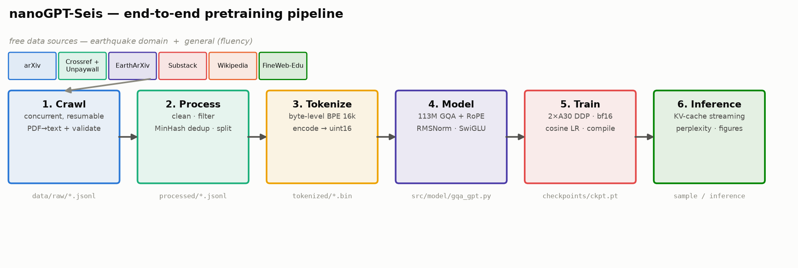
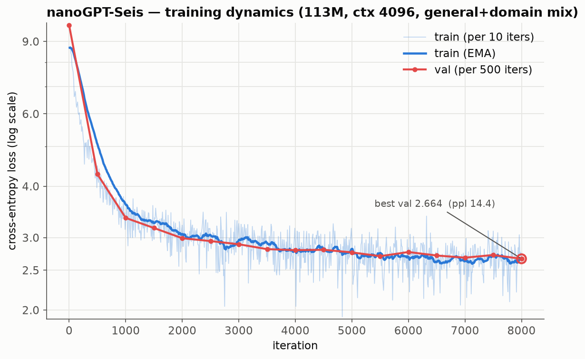
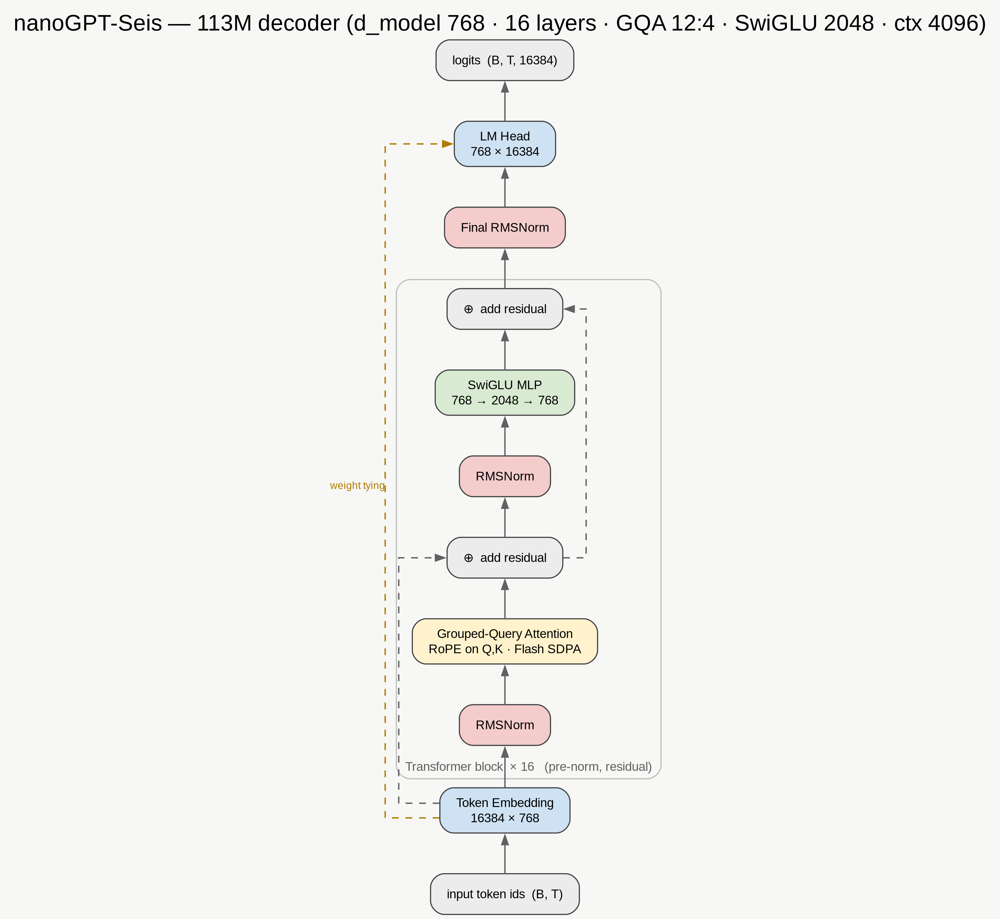
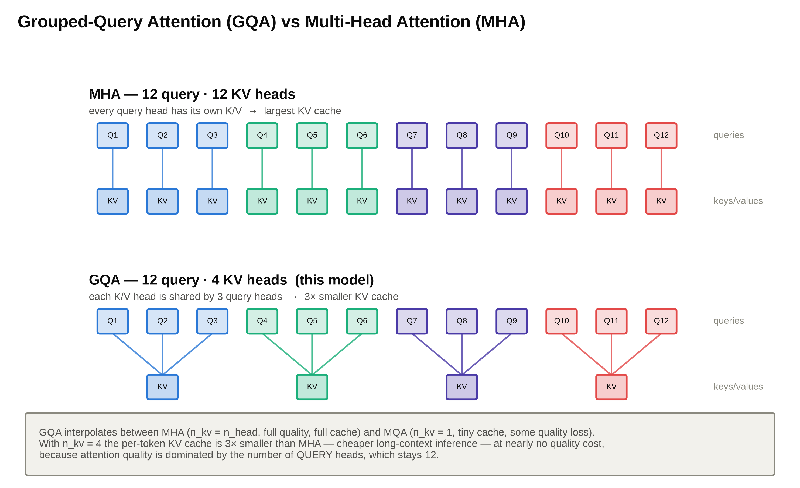
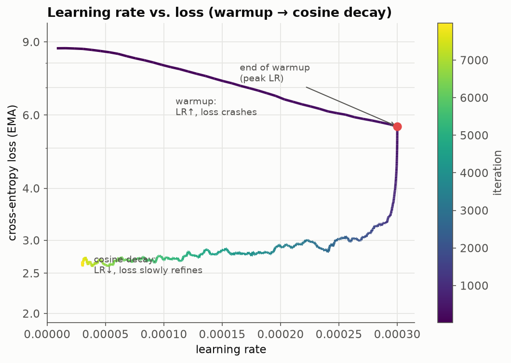
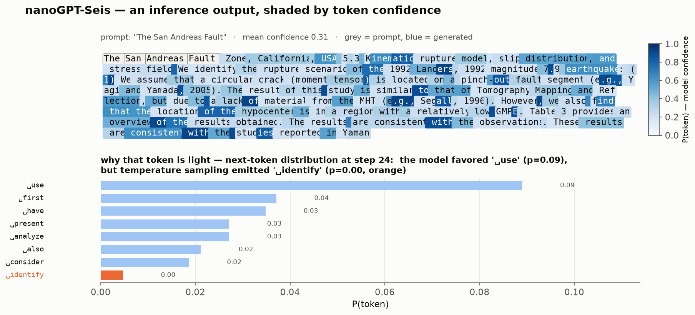

<div align="center">

# 🌍 nanoGPT-Seis

**Train a small GPT for earthquake science — the entire LLM lifecycle, from a blank folder to a talking model, explained block by block.**

Crawl → Clean → Tokenize → Model → Train → Infer, on 2× NVIDIA A30 (48 GB).

</div>



---

nanoGPT-Seis is a **teaching repository**. It is not trying to be a great earthquake
model — it is trying to make *every stage* of pretraining a language model legible:
where the data comes from, how it is cleaned and deduplicated, how a tokenizer is
built, why the Transformer looks the way it does, how it is trained across two GPUs,
and how it is served. Every design decision is explained, and every number
(perplexity, VRAM, tokens) is one we actually measured on this hardware.

The corpus is **earthquake / seismology text** — research papers, Wikipedia, and the
*Earthquake Insights* Substack — because a narrow domain lets a ~100M-param model
become genuinely fluent on a single node, so you can see the whole loop close in a
day, not a month.

> **Status:** pretraining is complete. Supervised fine-tuning (SFT) and RL (DPO/GRPO)
> are on the roadmap — see [§10](#10-roadmap).

## Table of contents
1. [Results at a glance](#1-results-at-a-glance)
2. [Quick start](#2-quick-start)
3. [Stage 1 — Data crawling](#3-stage-1--data-crawling)
4. [Stage 2 — Processing & dedup](#4-stage-2--processing--dedup)
5. [Stage 3 — The BPE tokenizer](#5-stage-3--the-bpe-tokenizer)
6. [Stage 4 — The model (RoPE, GQA, …)](#6-stage-4--the-model)
7. [Stage 5 — Training (DDP, VRAM, LR)](#7-stage-5--training)
8. [Stage 6 — Inference](#8-stage-6--inference)
9. [Repository layout](#9-repository-layout)
10. [Roadmap](#10-roadmap)

---

## 1. Results at a glance

| | value |
|---|---|
| Corpus | 533,248 docs · 485.7M words · **822.7M training tokens** (≈2.4:1 general:domain) |
| Model | **113M** params — decoder-only, GQA + RoPE + RMSNorm + SwiGLU |
| Hardware | 2× NVIDIA A30 (24 GB each), bf16, DDP |
| Context length | **4096** tokens |
| Training | 8,000 iters (~3.8 epochs), ~6.5 h, ~2.9 s/iter |
| Fluency (bits/byte, general text) | **0.997** — vs 1.527 for a domain-only base (**−35%**) |
| Inference | KV-cached streaming, ~176 ms to first token, anti-repeat sampler |

<p align="center"></p>

Three findings worth pausing on:

- **Longer context helped.** A controlled A/B (data held fixed) — retraining at 4096
  vs 1024 dropped perplexity ~11% (9.74 → 10.93 domain-only) for only ~26% more
  compute per step — papers have long-range structure a 1024-token window can't see across.
- **The model uses that context.** In a 4096-token window, loss on tokens at positions
  2048–4096 is **25% lower** than at 0–64 — it conditions on thousands of preceding
  tokens (see [§8](#8-stage-6--inference)).
- **A general-text mix restores fluency.** Adding Wikipedia + FineWeb-Edu (~2.4:1
  general:domain) cut bits/byte on general prose by 35% vs a paper-only base — see the
  data-mix comparison below.

### Data mix: domain-only (v1) → general + domain (v2)

A paper-only base is fluent in paper-register but repetitive/incoherent in plain
prose. Adding ~540M tokens of Wikipedia + FineWeb-Edu (→ ~823M train tokens,
~2.4:1 general:domain, ~3.8 epochs) gives **v2**. Measured with **bits-per-byte**
(tokenizer-independent, so v1↔v2 is fair; `src/compare_models.py`):

| held-out text | v1 (domain-only) | v2 (mix) | |
|---|---|---|---|
| general (Wikipedia/web) | 1.527 | **0.997** | **−35%** |
| earthquake papers | **0.776** | 0.951 | +22% |

v2 is far more fluent on general prose (and generates coherent non-earthquake text
where v1 emits gibberish), at the cost of some domain sharpness — the classic
fluency↔specialization trade-off. This fluent base is the right starting point for
SFT; base pretraining alone never yields chat. Domain-only weights are kept as
`checkpoints/ckpt_v1_domain.pt`.

---

## 2. Quick start

```bash
# environment (a working CUDA-12.4 PyTorch; see the note below)
conda activate nanogpt_seis
pip install -r requirements.txt

# --- run the whole pipeline ---
python -m src.crawl.wikipedia        --max-pages 500
python -m src.crawl.fulltext         --per-journal 3000 --broad 30000 --workers 64
python -m src.crawl.preprints        --arxiv 3000 --eartharxiv 2000
python -m src.crawl.substack         --max 500

python -m src.process.build_corpus   --val-frac 0.005      # clean · dedup · split
python -m src.tokenizer.train_bpe    --vocab-size 16384    # train the tokenizer
python -m src.tokenizer.encode                             # → uint16 shards

torchrun --standalone --nproc_per_node=2 \
    -m src.train --config configs/gpt120m_ctx4k.yaml       # train on 2 GPUs

python -m src.inference --prompt "The 2011 Tohoku earthquake"   # streams live
```

> **⚠️ Environment gotcha.** A PyTorch built for a *newer* CUDA than your driver will
> silently report `cuda.is_available() == False` and fall back to CPU. Verify with
> `python -c "import torch; print(torch.cuda.is_available())"` — it must print `True`.
> This project uses `torch 2.6.0+cu124` to match a CUDA-12.5 driver.

---

## 3. Stage 1 — Data crawling

**Goal:** assemble a large, legal, full-text earthquake corpus from free sources.
Code: `src/crawl/`.

### 3.1 The sources and how each is fetched

| source | module | what we pull | mechanism |
|---|---|---|---|
| Research papers | `fulltext.py` | OA full-text PDFs of earthquake papers | **Crossref** (DOIs) → **Unpaywall** (OA PDF) → download → extract |
| Preprints | `preprints.py` | arXiv + EarthArXiv full text | arXiv API + OSF/DOI → PDF |
| Wikipedia | `wikipedia.py` | pages titled *earthquake* | MediaWiki API plaintext extracts |
| Substack | `substack.py` | *Earthquake Insights* articles | archive API + HTML body parse |
| General text | `general.py` | Wikipedia + FineWeb-Edu (fluency mix) | HF `datasets` streaming to a token budget |

> **Why a general-text mix?** A ~113M model trained *only* on research papers
> becomes fluent in paper-register but repetitive and incoherent in plain prose,
> and 240M tokens is far below compute-optimal. So we add ~240M tokens of
> **Wikipedia** (encyclopedic) + **FineWeb-Edu** (quality-filtered educational web)
> for a ~1:1 general:domain mix — a fluent base that the planned SFT stage can then
> make conversational. (Base pretraining alone never yields chat; that's SFT.)

Every document is normalized to one schema (`src/crawl/common.py`):

```python
@dataclass
class Doc:
    source: str          # "fulltext" | "arxiv" | "wikipedia" | ...
    id: str              # stable per-source id (used for dedup)
    title: str
    text: str            # the cleaned body we will tokenize
    url: str = ""
    date: str = ""
    extra: dict = field(default_factory=dict)   # venue, cited_by, full_text, ...
```

### 3.2 How the web crawling actually works

**Finding the papers (Crossref).** Crossref indexes ~150M scholarly works with a free,
generous API. We page through earthquake journal-articles with a deep **cursor**
(no offset limit), filtered by journal ISSN:

```python
# src/crawl/fulltext.py — iter_crossref()
params = {"rows": 1000, "cursor": cursor,
          "filter": "type:journal-article,issn:0094-8276",   # e.g. GRL
          "query.bibliographic": "earthquake", "mailto": EMAIL}
```

**Finding the open PDF (Unpaywall).** A DOI is not a PDF. Unpaywall (free, ~100k/day)
maps a DOI to its legal open-access copies. We try **repository (green OA) locations
first** — publisher links are frequently bot-blocked stubs:

```python
# repository copies download far more reliably than publisher links
prio = 0 if loc.get("host_type") == "repository" else 1
```

**Downloading in parallel, politely.** PDFs come from *many* hosts, so we use a thread
pool but throttle **per host** — different servers download concurrently while any
single server stays rate-limited:

```python
class HostThrottle:                 # src/crawl/fulltext.py
    def wait(self, host):
        with self._guard:                                  # get/create this host's lock
            lk = self._locks.setdefault(host, threading.Lock())
            self._last.setdefault(host, 0.0)
        with lk:                                           # serialize only this host
            delta = self.min - (time.monotonic() - self._last[host])
            if delta > 0: time.sleep(delta)
            self._last[host] = time.monotonic()
```

**Validating every download.** Not every "OA PDF" is real — many are 5 KB anti-bot
landing pages. We accept a download only if it is a real PDF with enough text:

```python
if not b.startswith(b"%PDF"): return None          # HTML / stub
if doc.page_count < 2:        return None           # cover page
if len(text) < min_chars:     return None           # too little extracted
```

**Not wasting the budget.** Some journals (Science, Nature) are almost entirely
paywalled — scanning thousands of their DOIs would burn the Unpaywall budget for zero
full text. A **low-yield abort gate** skips a journal once its hit-rate stays under a
threshold:

```python
if scanned >= abort_after and got_ft / max(1, scanned) < min_hit:
    break        # this venue isn't worth more API calls
```

**Resumable.** Output is appended line-by-line and already-fetched ids are skipped on
restart, so a multi-hour crawl survives interruption:

```python
done = _load_done_ids(out)          # ids already in the JSONL
...
if iid in done: continue            # skip work we already have
```

> **War story (why Crossref + Unpaywall).** This project originally enumerated papers
> via **OpenAlex**, which changed to a paid credit model mid-build — the free daily
> budget ran out after ~100 requests. Crossref + Unpaywall is the free, robust
> replacement, and it is what the code ships with. The lesson — *pin your data source
> assumptions and make the crawler resumable* — is baked into the design.

Full-text yield varies a lot by source: **arXiv ~99%** (open by design), the broad OA
pool **~15%**, paywalled journals **~0%** (abstract fallback). Net corpus: ~20k
full-text papers + ~26k abstracts.

---

## 4. Stage 2 — Processing & dedup

Code: `src/process/`. Turns messy `data/raw/*.jsonl` into clean train/val splits.

### 4.1 Cleaning (source-aware) — `clean.py`

```python
def normalize(text):
    text = html.unescape(text)                 # &#13; &amp; → real chars
    text = unicodedata.normalize("NFKC", text) # fi ligatures, full-width, …
    text = _CTRL_RE.sub("", text)              # strip control bytes
    text = _MULTISPACE_RE.sub(" ", text)       # collapse whitespace
    ...
```

PDFs get extra care: line-break **de-hyphenation** (`earth-\nquake → earthquake`) and
**reference-section stripping** (truncate at the last *References/Bibliography*
heading — the bibliography is noise for a language model).

### 4.2 Quality filtering

Three cheap, effective filters (`passes_filters`):

- **length** — drop < 200 chars;
- **English ratio** — fraction of tokens that are common English stopwords; drops the
  Spanish-translated Substack posts without a language-ID dependency;
- **alpha ratio** — fraction of letters/spaces; drops garbled PDF tables and math dumps.

### 4.3 Deduplication — `dedup.py`

Two passes, cheap-first:

1. **Exact** — a SHA-1 of the whitespace-collapsed lowercased text catches byte-identical
   duplicates instantly.
2. **Near-duplicate (MinHash + LSH)** — catches *near*-identical docs (e.g. an abstract
   that also appears inside a full-text PDF). Each document becomes a set of word
   5-grams (**shingles**); a **MinHash** signature (128 permutations) estimates
   Jaccard similarity in constant space; an **LSH** index finds candidates without
   comparing all pairs. Documents are processed **longest-first**, so when a near-dup
   is found we keep the *fullest* version:

```python
m = MinHash(num_perm=128)
for shingle in word_5grams(text): m.update(shingle.encode())
if lsh.query(m):          # a near-duplicate already kept
    near_dups += 1
else:
    lsh.insert(id, m); kept.append(doc)
```

On the real corpus this removed 1,126 exact + 304 near duplicates. Finally the docs are
shuffled with a fixed seed and split into train / val, preserving each doc's metadata.

---

## 5. Stage 3 — The BPE tokenizer

Code: `src/tokenizer/`. We **train our own** tokenizer rather than reuse GPT-2's —
owning this stage is the point, and a domain vocabulary encodes seismology text more
efficiently.

### 5.1 Why byte-level BPE

**BPE** (Byte-Pair Encoding) starts from single characters and greedily merges the most
frequent adjacent pair, over and over, until it reaches the target vocab size. Frequent
sequences (`earthquake`, `sub`, `duction`) become single tokens; rare ones stay in
pieces. **Byte-level** means the base alphabet is the 256 raw bytes, so **any** input
is representable — there are no `<unk>` tokens, ever.

```python
# src/tokenizer/train_bpe.py
tokenizer = Tokenizer(BPE(unk_token=None))
tokenizer.pre_tokenizer = ByteLevel(add_prefix_space=False)
trainer = BpeTrainer(vocab_size=16384, special_tokens=["<|endoftext|>"],
                     initial_alphabet=ByteLevel.alphabet())   # all 256 bytes
tokenizer.train_from_iterator(_iter_texts(train_jsonl), trainer)
```

We use **16,384** tokens (vs GPT-2's 50,257): smaller vocab → smaller embedding matrix
(a big fraction of a small model's params) and the domain is narrow. Measured
compression on our corpus is ~3.9 chars/token — healthy. The single special token
`<|endoftext|>` marks document boundaries.

### 5.2 Encoding to `uint16` shards

`encode.py` streams the corpus through the tokenizer and writes one flat array of token
ids per split, documents separated by the eot id:

```python
for enc in tok.encode_batch(batch):
    buf.extend(enc.ids); buf.append(eot_id)       # eot between docs
    if len(buf) >= FLUSH_EVERY:
        np.asarray(buf, dtype=np.uint16).tofile(fout)   # 2 bytes/token
```

`uint16` (0–65535) fits our 16k vocab in 2 bytes/token → 822.7M tokens ≈ 1.6 GB, and the
training loader `np.memmap`s it (no RAM blow-up). **Crucially, this file is
context-length-agnostic** — the window width is chosen at *training* time, which is why
switching 1024→4096 needed no re-tokenization.

---

## 6. Stage 4 — The model

Code: `src/model/gqa_gpt.py`. A modern, Llama-style decoder-only Transformer.



### 6.1 Why these components

| choice | over the "classic GPT" alternative | why |
|---|---|---|
| **RMSNorm** | LayerNorm | fewer ops, no mean-subtraction, same quality — the Llama default |
| **RoPE** | learned position embeddings | relative, extrapolates, no position table to learn |
| **GQA** | full multi-head attention | 3× smaller KV cache for long-context inference, ~no quality loss |
| **SwiGLU** | GELU MLP | gated activation, better quality per parameter |
| **weight tying** | separate input/output embeddings | saves 12.6M params on a small model, regularizes |
| **no biases** | linear layers with bias | biases add little; simpler and slightly faster |

### 6.2 RoPE — Rotary Position Embeddings

A Transformer is permutation-invariant; it needs to be told token order. RoPE encodes
position by **rotating** each query/key vector by an angle proportional to its position.
The dot product of a rotated query at position *m* and key at position *n* then depends
only on their **relative** distance *m − n* — which is exactly what attention should
care about, and it lets the model handle positions it can partly extrapolate to.

```python
def _apply_rope(x, cos, sin):          # x: (B, n_head, T, head_dim)
    return x * cos + _rotate_half(x) * sin
```

`cos`/`sin` are precomputed once per position and applied to Q and K just before
attention. No learned parameters.

### 6.3 GQA — Grouped-Query Attention



Standard multi-head attention gives every one of the 12 query heads its own key/value
head — so at inference the **KV cache** (the stored keys/values for every past token)
holds 12 heads' worth per token. GQA lets several query heads **share** a KV head. We
use **12 query : 4 KV heads**, so the KV cache is **3× smaller** — cheaper long-context
inference — at nearly no quality cost, because attention quality is dominated by the
number of *query* heads (still 12).

```python
# src/model/gqa_gpt.py — GroupedQueryAttention
# Per-head projection written as an einsum so the contraction is explicit:
#   out[b, h, t, i] = Σ_d  x[b, t, d] · W[h, i, d]
q = torch.einsum("btd,hid->bhti", x, self.wq.weight.view(n_head, hd, d))  # 12 heads
k = torch.einsum("btd,hid->bhti", x, self.wk.weight.view(n_kv,   hd, d))  #  4 heads  ← fewer
v = torch.einsum("btd,hid->bhti", x, self.wv.weight.view(n_kv,   hd, d))  #  4 heads
if n_kv != n_head:                       # broadcast KV heads to match Q for SDPA
    k = k.repeat_interleave(rep, dim=1)  # (the cache itself still stores only n_kv heads)
    v = v.repeat_interleave(rep, dim=1)
y = F.scaled_dot_product_attention(q, k, v, is_causal=True)   # FlashAttention kernel
```

Using PyTorch's `scaled_dot_product_attention` gives us the fused **FlashAttention**
kernel for free — O(T) memory attention, which is what makes 4096 context affordable.

### 6.4 Hyperparameters and why

`configs/gpt120m_ctx4k.yaml`:

```yaml
n_layer: 16      d_model: 768      n_head: 12   n_kv_head: 4     # GQA 12:4
block_size: 4096   vocab_size: 16384   ffn hidden: 2048 (SwiGLU)
```

- **d_model 768 / 12 heads / 16 layers** ≈ GPT-2-small shape → ~113M params, a size
  that trains comfortably on one node and is big enough to be fluent.
- **head_dim 64** (768/12) — the sweet spot FlashAttention is tuned for.
- **SwiGLU hidden 2048** — the Llama `⌈8/3·d⌉` rule rounded to a multiple of 256.
- The init uses the **GPT-2 residual scaling** trick (`std = 0.02/√(2·n_layer)` on the
  output projections) so the residual stream doesn't blow up with depth.

Sanity check that the model + loss are wired correctly: at initialization the loss
should equal `ln(vocab_size) = ln(16384) = 9.70`. Ours starts at **9.85** ✓.

---

## 7. Stage 5 — Training

Code: `src/train.py`. Data-parallel across both A30s.

### 7.1 DDP — how two GPUs train one model

We launch with `torchrun --nproc_per_node=2`, which starts one process per GPU.
**DistributedDataParallel** keeps a replica of the model on each GPU; each processes a
different micro-batch, and gradients are **all-reduced** (averaged) across GPUs before
the optimizer step — so both replicas stay identical. The effective batch is the sum
across GPUs.

```python
init_process_group(backend="nccl")
model = torch.compile(model)                       # fuse kernels
model = DDP(model, device_ids=[local_rank])        # replicate + all-reduce grads
```

**Gradient accumulation** multiplies the batch further: we run several micro-batches
before stepping, and — importantly — only sync gradients on the *last* one, so the
in-between backward passes don't pay the all-reduce cost:

```python
for micro in range(grad_accum):
    model.require_backward_grad_sync = (micro == grad_accum - 1)
    with autocast(bfloat16):
        _, loss = model(X, Y)
    (loss / grad_accum).backward()
torch.nn.utils.clip_grad_norm_(model.parameters(), 1.0)   # clip exploding grads
optimizer.step()
```

Global batch = `batch(4) × grad_accum(12) × gpus(2) × ctx(4096)` = **393,216
tokens/iter**. **bf16** autocast halves memory and doubles throughput vs fp32 with no
loss-scaling needed (bf16 has fp32's exponent range).

### 7.2 The learning-rate schedule

Linear **warmup** (400 iters) then **cosine decay** to a floor. Warmup avoids early
divergence while Adam's statistics are cold; cosine decay squeezes out the last
improvements at low LR. The relationship is striking when you plot loss against LR:

<p align="center"></p>

During warmup the LR climbs and the loss crashes; during the long cosine tail the LR
falls and the loss slowly refines — the late low-LR phase gave our final best val loss.

### 7.3 Estimating VRAM before you OOM

Training memory has a **fixed** part and a **batch-dependent** part.

**Fixed (independent of batch):** parameters + gradients + Adam's two moments.
With fp32 master weights and fused AdamW:

```
params (fp32)   113M × 4 B = 0.45 GB
grads  (fp32)   113M × 4 B = 0.45 GB
Adam m,v (fp32) 113M × 8 B = 0.90 GB
                            ─────────
fixed ≈ 1.8 GB
```

**Batch-dependent (activations):** grows with `batch × seq_len × n_layer × d_model`.
This is the hard-to-predict part (FlashAttention, autocast and `torch.compile` all
change it), so we **measure it empirically** with a one-shot probe — run a single
forward+backward and read the peak:

```python
torch.cuda.reset_peak_memory_stats()
loss = model(x, y)[1]; loss.backward(); opt.step()
print(torch.cuda.max_memory_allocated() / 1e9, "GB")
```

That's how we picked the batch size: **batch 4 @ 4096 → 15.2 GB** (fits 24 GB with
headroom); batch 8 @ 4096 OOMs. This probe-first habit beats guessing every time.

Measured at run time: ~12 GB/GPU, both at 100% utilization, ~2.9 s/iter.

---

## 8. Stage 6 — Inference

Code: `src/inference.py` (engine + tests), `src/sample.py` (simple sampler).

### 8.1 KV-cache + streaming

Naive generation recomputes the whole sequence every step — **O(T²)**. With a
**KV-cache** we keep each layer's past keys/values and feed only the new token each
step — **O(T)**, so throughput stays flat (~83 tok/s) as the sequence grows toward
4096, where the naive path degrades to ~63 tok/s. Correctness is verified against the
naive path (greedy output is byte-identical).

Generation **streams** token-by-token (`generate_stream` yields one token per step; the
CLI prints with `flush=True`), so you see text ~176 ms after hitting enter instead of
waiting for the whole block. Decoding uses a "decode-the-running-list, emit-the-suffix"
trick so multi-byte characters that span BPE tokens render correctly.

The sampler also supports **anti-repetition** controls (on by default in the CLIs):
`--repetition-penalty` (downweights already-seen tokens) and `--no-repeat-ngram`
(hard-bans repeating n-grams). At 0.1B params the base model occasionally falls
into degenerate loops (e.g. inside a paper table); these decisively fix it —
`Mj Mj Mj…` → a coherent citation — without changing correctness (both default
to off inside the model, on in the CLI).

### 8.2 Looking inside a generation

`generate_annotated()` records, for every emitted token, the raw probability the
model assigned it and the top-8 alternatives. Shading a real sample by that
confidence makes the model's behavior visible — and shows what temperature
sampling does:



Dark = confident (`Mw 9.0`, `the`, `earthquake`), light = uncertain. The bottom
panel explains one light token: the model's top choice was `area` (p 0.59), but
with temperature 0.8 it *sampled* the rarer `plane` (p 0.01) — "rupture plane",
still perfectly valid seismology. This is exactly the exploration/quality trade-off
that `--temperature` controls.

### 8.3 Does the model actually use 4096 tokens of context?

The decisive test (`--test`, `context_utilization`): measure loss by position within a
full window. If long context helps, later positions — which have more preceding tokens
to condition on — should be predicted better:

| position in window | mean loss |
|---|---|
| 0–64 (little context) | 2.89 |
| 1024–2048 | 2.22 |
| 2048–4096 (full context) | **2.16** |

**−25%** from early to late — the model demonstrably exploits the long context.

```bash
python -m src.inference --test           # generation + perplexity + context-utilization
python -m src.inference --interactive    # streaming REPL
python -m src.inference --perplexity-text "..."   # score any text
```

A nice sanity check of specialization: perplexity on a seismology sentence is ~13–16,
but on generic English it is ~600–900 — the model is sharply tuned to its domain.

---

## 9. Repository layout

```
nanogpt_seis/
├── README.md                  ← you are here
├── configs/                   ← YAML model+training configs
│   ├── gpt120m.yaml           (1024-ctx baseline)
│   ├── gpt120m_ctx4k.yaml     (4096-ctx, the main model)
│   └── gpt_small.yaml         (~32M, for fast pipeline iteration)
├── src/
│   ├── crawl/                 ← Stage 1: data crawlers
│   │   ├── common.py          (Doc schema, cached polite HTTP)
│   │   ├── fulltext.py        (Crossref + Unpaywall, concurrent, resumable)
│   │   ├── preprints.py       (arXiv + EarthArXiv)
│   │   ├── wikipedia.py  substack.py  arxiv_openalex.py
│   ├── process/               ← Stage 2: clean / filter / dedup / split
│   │   ├── clean.py  dedup.py  build_corpus.py
│   ├── tokenizer/             ← Stage 3: BPE
│   │   ├── train_bpe.py  encode.py
│   ├── model/gqa_gpt.py       ← Stage 4: the Transformer
│   ├── train.py               ← Stage 5: DDP training loop
│   ├── inference.py sample.py ← Stage 6: serving
│   ├── plot_training.py       ← training-curve plots
│   └── figures/               ← the diagrams in this README
├── assets/                    ← generated figures
├── data/                      ← raw / processed / tokenized (git-ignored)
└── checkpoints/               ← weights, logs, plots (weights git-ignored)
```

Regenerate every figure in this README:
```bash
python -m src.figures.workflow
python -m src.figures.architecture
python -m src.figures.gqa_vs_mha
python -m src.figures.training_curves
CUDA_VISIBLE_DEVICES=0 python -m src.figures.generation_example  # needs a trained ckpt + GPU
```

---

## 10. Roadmap

- [x] Data pipeline · tokenizer · model · **pretraining** · inference
- [ ] **SFT** — instruction/QA pairs over the earthquake corpus
- [ ] **Preference optimization** — DPO / GRPO
- [ ] Longer context (8192+) with sliding-window KV eviction
- [ ] CUDA-graph / compiled decode for higher tok/s

## Acknowledgements

Inspired by Andrej Karpathy's **nanoGPT** and the **minimind** project's
teach-by-building philosophy. Data courtesy of **Crossref**, **Unpaywall**, **arXiv**,
**EarthArXiv/OSF**, **Wikipedia**, and the **Earthquake Insights** Substack — thanks to
the open-science infrastructure that makes a project like this possible.

## License

MIT — see [LICENSE](LICENSE).
