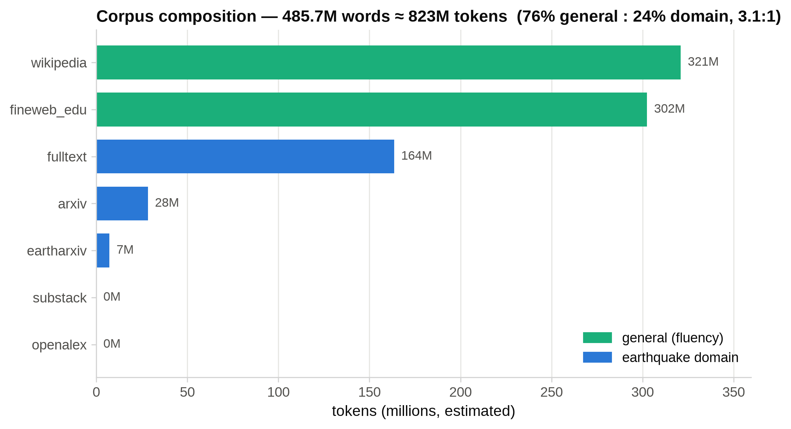
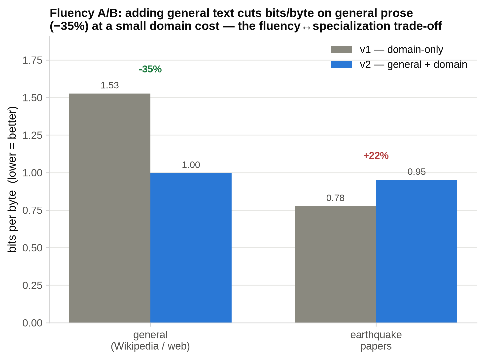
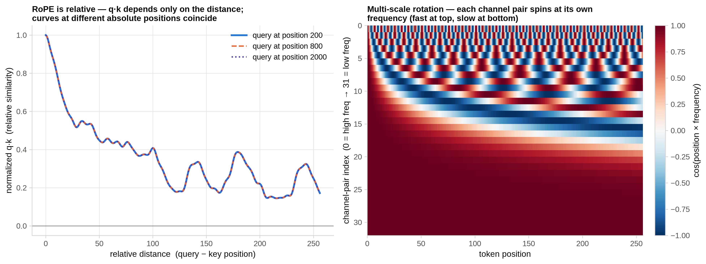
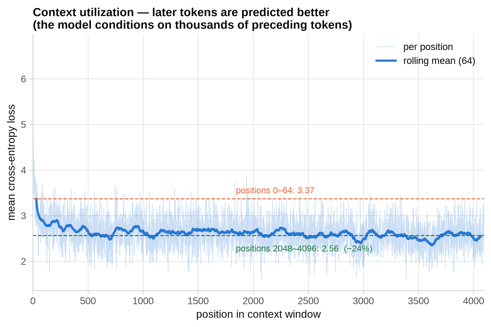
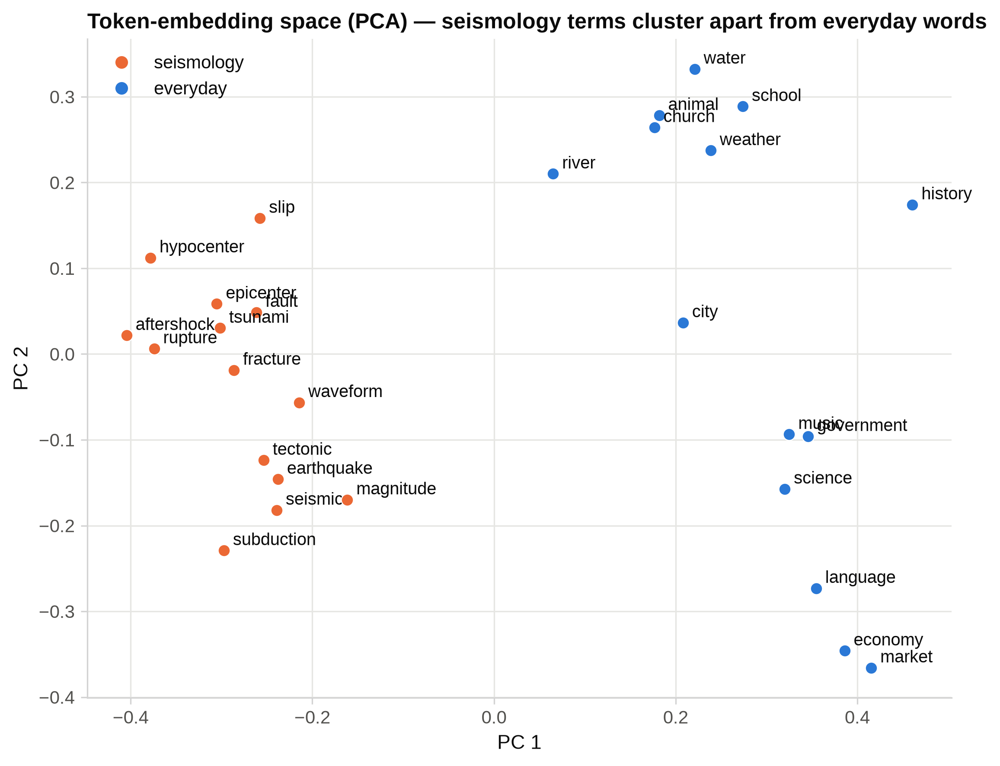
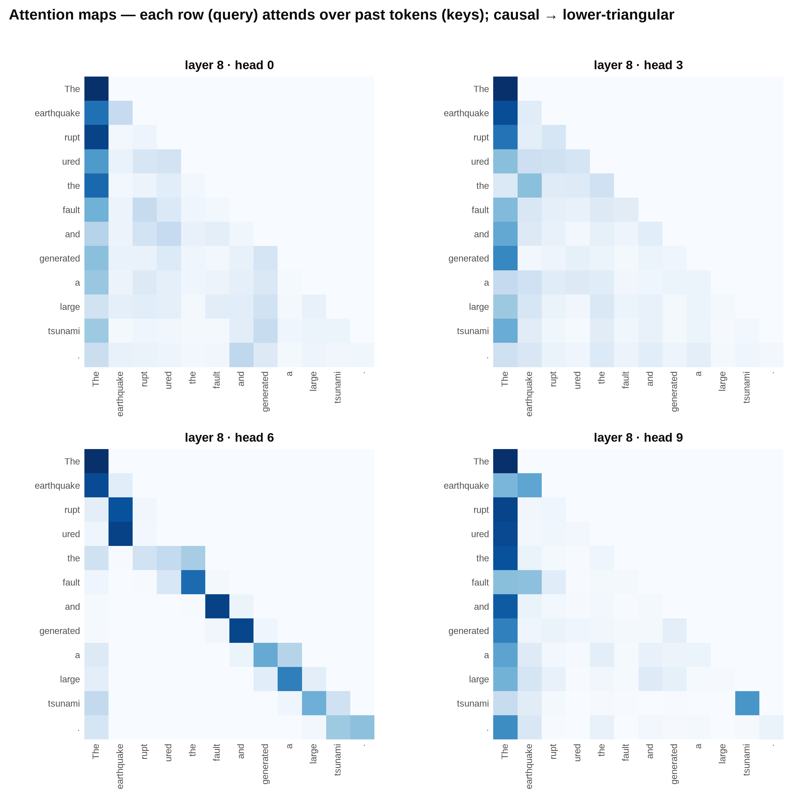
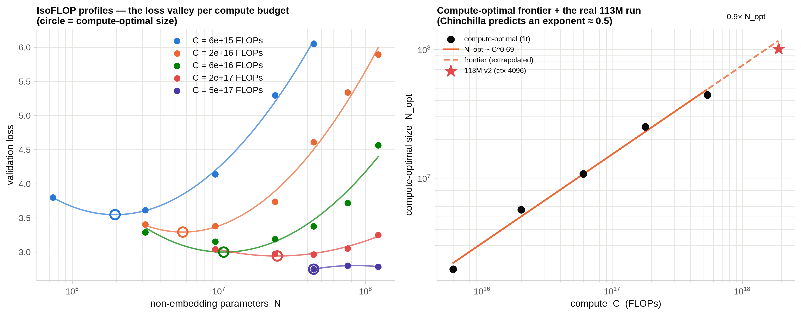

<div align="center">

# 🌍 nanoGPT-Seis

**Train a small GPT for earthquake science — the entire LLM lifecycle, from a blank folder to a talking model, explained block by block.**

Crawl → Clean → Tokenize → Model → Train → Infer, on 2× NVIDIA A30 (48 GB).

</div>


<p align="center">Six free data sources → crawl → clean/dedup → 16k BPE →
113M GQA+RoPE decoder → 2-GPU DDP training → streaming inference. Each stage is a
section below.</p>

---

nanoGPT-Seis is a teaching repository. It is not trying to be a great earthquake
model — it is trying to make every stage of pretraining a language model legible:
where the data comes from, how it is cleaned and deduplicated, how a tokenizer is
built, why the Transformer looks the way it does, how it is trained across two GPUs,
and how it is served. Every design decision is explained, and every number
(perplexity, VRAM, tokens) is one we actually measured on this hardware.

The corpus mixes earthquake / seismology text (open-access papers via
Crossref+Unpaywall, arXiv/EarthArXiv preprints, the "Earthquake Insights" Substack)
with general text (Wikipedia + FineWeb-Edu) for plain-language fluency — about
24% domain / 76% general. A focused corpus lets a ~100M-param model become
genuinely fluent on a single node, so you can see the whole loop close in a day, not
a month. (Why the general mix? See [§1](#1-results-at-a-glance).)

> **Status:** the pretraining lifecycle is complete — crawl through inference.

## Table of contents
1. [Results at a glance](#1-results-at-a-glance)
2. [Quick start](#2-quick-start)
3. [Stage 1 — Data crawling](#3-stage-1--data-crawling)
4. [Stage 2 — Processing & dedup](#4-stage-2--processing--dedup)
5. [Stage 3 — The BPE tokenizer](#5-stage-3--the-bpe-tokenizer)
6. [Stage 4 — The model (RoPE, GQA, …)](#6-stage-4--the-model)
7. [Stage 5 — Training (DDP, VRAM, LR)](#7-stage-5--training)
8. [Stage 6 — Inference](#8-stage-6--inference)
9. [Repository layout](#9-repository-layout)
10. [Scaling-law experiments](#10-scaling-law-experiments)

---

## 1. Results at a glance

| | value |
|---|---|
| Corpus | 533,248 docs · 485.7M words · **822.7M training tokens** (≈2.4:1 general:domain) |
| Model | **113M** params — decoder-only, GQA + RoPE + RMSNorm + SwiGLU |
| Hardware | 2× NVIDIA A30 (24 GB each), bf16, DDP — also runs on a single RTX 3090/4090, or 12–16 GB with a smaller batch ([§7.5](#75-running-on-one-gpu-or-a-smaller-one)) |
| Context length | **4096** tokens |
| Training | 8,000 iters (~3.8 epochs), ~6.5 h, ~2.9 s/iter |
| Fluency (bits/byte, general text) | **0.997** — vs 1.527 for a domain-only base (**−35%**) |
| Inference | KV-cached streaming, ~176 ms to first token, anti-repeat sampler |

<p align="center"></p>

Three findings worth pausing on:

- **Longer context helped.** A controlled A/B (data held fixed) — retraining at 4096
  vs 1024 dropped perplexity ~11% (9.74 → 10.93 domain-only) for only ~26% more
  compute per step — papers have long-range structure a 1024-token window can't see across.
- **The model uses that context.** In a 4096-token window, loss on tokens at positions
  2048–4096 is 25% lower than at 0–64 — it conditions on thousands of preceding
  tokens (see [§8](#8-stage-6--inference)).
- **A general-text mix restores fluency.** Adding Wikipedia + FineWeb-Edu (~2.4:1
  general:domain) cut bits/byte on general prose by 35% vs a paper-only base — see the
  data-mix comparison below.

### Data mix: domain-only (v1) → general + domain (v2)

A paper-only base is fluent in paper-register but repetitive/incoherent in plain
prose. Adding ~540M tokens of Wikipedia + FineWeb-Edu (→ ~823M train tokens,
~2.4:1 general:domain, ~3.8 epochs — within the ~4-epoch repeat budget shown to be
near-lossless by [Muennighoff et al., 2023](https://arxiv.org/abs/2305.16264)) gives v2.

<p align="center"></p>

Measured with bits-per-byte (tokenizer-independent, so v1↔v2 is fair;
`src/compare_models.py`):

<p align="center"></p>

v2 is far more fluent on general prose (−35% bits/byte) and generates coherent
non-earthquake text where v1 emits gibberish, at the cost of some domain sharpness
(+22%) — the classic fluency↔specialization trade-off. This fluent base is the
right starting point for SFT; base pretraining alone never yields chat. Domain-only
weights are kept as `checkpoints/ckpt_v1_domain.pt`.

---

## 2. Quick start

### 2.1 Try the pretrained model

The pretrained 113M checkpoint is hosted on the Hugging Face Hub:
[`jiazhe868/nanogpt_seis`](https://huggingface.co/jiazhe868/nanogpt_seis).

```bash
# environment (a working CUDA-12.4 PyTorch; see the note below)
conda activate nanogpt_seis
pip install -r requirements.txt

# download the checkpoint, tokenizer, and model config into the paths expected by
# src/inference.py
huggingface-cli download jiazhe868/nanogpt_seis \
    checkpoints/ckpt.pt \
    data/tokenized/tokenizer.json \
    data/tokenized/meta.json \
    configs/gpt120m_ctx4k.yaml \
    --local-dir .

python -m src.inference --prompt "The 2011 Tohoku earthquake"
```

### 2.2 Reproduce pretraining from scratch

```bash
# environment (a working CUDA-12.4 PyTorch; see the note below)
conda activate nanogpt_seis
pip install -r requirements.txt

# --- run the whole pipeline ---
# earthquake-domain sources
python -m src.crawl.wikipedia        --max-pages 500                              # earthquake-titled pages
python -m src.crawl.fulltext         --per-journal 3000 --broad 30000 --workers 64
python -m src.crawl.preprints        --arxiv 3000 --eartharxiv 2000
python -m src.crawl.substack         --max 500
# general-text mix for fluency (~540M tokens: Wikipedia + FineWeb-Edu)
python -m src.crawl.general          --wiki-tokens 300000000 --fineweb-tokens 240000000

python -m src.process.build_corpus   --val-frac 0.005      # clean · dedup · split
python -m src.tokenizer.train_bpe    --vocab-size 16384    # train the tokenizer
python -m src.tokenizer.encode                             # → uint16 shards

torchrun --standalone --nproc_per_node=2 \
    -m src.train --config configs/gpt120m_ctx4k.yaml       # train on 2 GPUs

python -m src.inference --prompt "The 2011 Tohoku earthquake"   # streams live
```

> **⚠️ Environment gotcha.** A PyTorch built for a newer CUDA than your driver will
> silently report `cuda.is_available() == False` and fall back to CPU. Verify with
> `python -c "import torch; print(torch.cuda.is_available())"` — it must print `True`.
> This project uses `torch 2.6.0+cu124` to match a CUDA-12.5 driver.

---

## 3. Stage 1 — Data crawling

**Goal:** assemble a large, legal, full-text earthquake corpus from free sources.
Code: `src/crawl/`.

### 3.1 The sources and how each is fetched

| source | module | what we pull | mechanism |
|---|---|---|---|
| Research papers | `fulltext.py` | OA full-text PDFs of earthquake papers | Crossref (DOIs) → Unpaywall (OA PDF) → download → extract |
| Preprints | `preprints.py` | arXiv + EarthArXiv full text | arXiv API + OSF/DOI → PDF |
| Wikipedia | `wikipedia.py` | pages titled "earthquake" | MediaWiki API plaintext extracts |
| Substack | `substack.py` | "Earthquake Insights" articles | archive API + HTML body parse |
| General text | `general.py` | Wikipedia + FineWeb-Edu (fluency mix) | HF `datasets` streaming to a token budget |

> **Why a general-text mix?** A ~113M model trained only on research papers
> becomes fluent in paper-register but repetitive and incoherent in plain prose,
> and 240M tokens is far below compute-optimal ([Hoffmann et al., 2022](https://arxiv.org/abs/2203.15556)).
> So we add ~240M tokens of
> [Wikipedia](https://huggingface.co/datasets/wikimedia/wikipedia) (encyclopedic) +
> [FineWeb-Edu](https://huggingface.co/datasets/HuggingFaceFW/fineweb-edu)
> ([Penedo et al., 2024](https://arxiv.org/abs/2406.17557); quality-filtered educational web)
> for a ~1:1 general:domain mix — a fluent base that the planned SFT stage can then
> make conversational. (Base pretraining alone never yields chat; that's SFT.)

Every document is normalized to one schema (`src/crawl/common.py`):

```python
@dataclass
class Doc:
    source: str          # "fulltext" | "arxiv" | "wikipedia" | ...
    id: str              # stable per-source id (used for dedup)
    title: str
    text: str            # the cleaned body we will tokenize
    url: str = ""
    date: str = ""
    extra: dict = field(default_factory=dict)   # venue, cited_by, full_text, ...
```

### 3.2 How the web crawling actually works

**Finding the papers (Crossref).** Crossref indexes ~150M scholarly works with a free,
generous API. We page through earthquake journal-articles with a deep cursor
(no offset limit), filtered by journal ISSN:

```python
# src/crawl/fulltext.py — iter_crossref()
params = {"rows": 1000, "cursor": cursor,
          "filter": "type:journal-article,issn:0094-8276",   # e.g. GRL
          "query.bibliographic": "earthquake", "mailto": EMAIL}
```

**Finding the open PDF (Unpaywall).** A DOI is not a PDF. Unpaywall (free, ~100k/day)
maps a DOI to its legal open-access copies. We try repository (green OA) locations
first — publisher links are frequently bot-blocked stubs:

```python
# repository copies download far more reliably than publisher links
prio = 0 if loc.get("host_type") == "repository" else 1
```

**Downloading in parallel, politely.** PDFs come from many hosts, so we use a thread
pool but throttle per host — different servers download concurrently while any
single server stays rate-limited:

```python
class HostThrottle:                 # src/crawl/fulltext.py
    def wait(self, host):
        with self._guard:                                  # get/create this host's lock
            host_lock = self._locks.setdefault(host, threading.Lock())
            self._last.setdefault(host, 0.0)
        with host_lock:                                    # serialize only this host
            delta = self.min - (time.monotonic() - self._last[host])
            if delta > 0: time.sleep(delta)
            self._last[host] = time.monotonic()
```

**Validating every download.** Not every "OA PDF" is real — many are 5 KB anti-bot
landing pages. We accept a download only if it is a real PDF with enough text:

```python
if not pdf_bytes.startswith(b"%PDF"): return None   # HTML / stub
if doc.page_count < 2:                return None    # cover page
if len(text) < min_chars:             return None    # too little extracted
```

**Not wasting the budget.** Some journals (Science, Nature) are almost entirely
paywalled — scanning thousands of their DOIs would burn the Unpaywall budget for zero
full text. A low-yield abort gate skips a journal once its hit-rate stays under a
threshold:

```python
if scanned >= abort_after and got_ft / max(1, scanned) < min_hit:
    break        # this venue isn't worth more API calls
```

**Resumable.** Output is appended line-by-line and already-fetched ids are skipped on
restart, so a multi-hour crawl survives interruption:

```python
done = _load_done_ids(out)          # ids already in the JSONL
...
if iid in done: continue            # skip work we already have
```

> **War story (why Crossref + Unpaywall).** This project originally enumerated papers
> via OpenAlex, which changed to a paid credit model mid-build — the free daily
> budget ran out after ~100 requests. Crossref + Unpaywall is the free, robust
> replacement, and it is what the code ships with. The lesson — pin your data source
> assumptions and make the crawler resumable — is baked into the design.

Full-text yield varies a lot by source: arXiv ~99% (open by design), the broad OA
pool ~15%, paywalled journals ~0% (abstract fallback). Net corpus: ~20k
full-text papers + ~26k abstracts.

### 3.3 The general pattern — a thread-safe BFS crawler

The crawler above is API-driven, but the shape underneath is the classic one: a
breadth-first traversal of a link graph, run across many threads. It is worth writing
that general pattern out in full, because getting the concurrency right is the hard
part. The crux is shared state that every worker touches at once — a frontier of URLs
still to visit, and a set of URLs already seen.

Three rules make it correct:

- The frontier is a `queue.Queue`, which is internally synchronised: `get()` and
  `put()` are atomic, and `get()` blocks until work exists, so workers never busy-wait.
- The seen-set gets its own lock. "Is this URL new? if so, add it" is a
  read-modify-write; without the lock two threads can both judge the same URL new and
  enqueue it twice.
- Termination uses `Queue.join()` / `task_done()`. The hard question in a concurrent
  BFS is knowing when you are done: a worker finding the frontier momentarily empty does
  not mean the crawl is finished, because another worker may be one instruction away
  from enqueuing more links. `join()` counts outstanding tasks and only releases once
  every enqueued URL has been fully processed.

```python
import re, threading, queue, requests
from urllib.parse import urljoin, urldefrag, urlparse

class BFSCrawler:
    """Breadth-first web crawler: one shared frontier, N worker threads."""

    def __init__(self, seeds, max_pages=5000, n_workers=16, min_interval=1.0):
        self.frontier   = queue.Queue()          # thread-safe BFS queue of (url, depth)
        self.seen       = set(seeds)             # every URL ever enqueued
        self.seen_lock  = threading.Lock()       # guards `seen` (check-then-add races)
        self.pages      = []                     # kept (url, html) pairs
        self.pages_lock = threading.Lock()       # guards `pages` + the page counter
        self.max_pages  = max_pages
        self.n_workers  = n_workers
        self.throttle   = HostThrottle(min_interval)   # §3.2 — politeness, per host
        for s in seeds:
            self.frontier.put((s, 0))            # seed the frontier at depth 0

    def _links(self, base, html):                # extract absolute, de-fragmented links
        for m in re.finditer(r'href=["\'](.*?)["\']', html):
            url, _ = urldefrag(urljoin(base, m.group(1)))   # relative → absolute, drop #frag
            if url.startswith(("http://", "https://")):
                yield url

    def _enqueue(self, url, depth):
        with self.seen_lock:              # the check AND the add are ONE critical section,
            if url in self.seen:          # else two threads both see `url` as new and
                return                    # enqueue it twice
            self.seen.add(url)
        self.frontier.put((url, depth))

    def _worker(self):
        while True:
            url, depth = self.frontier.get()      # blocks; (None, _) is the stop sentinel
            if url is None:
                self.frontier.task_done()
                return
            try:
                with self.pages_lock:
                    if len(self.pages) >= self.max_pages:
                        continue                  # budget spent — drain the rest quietly
                self.throttle.wait(urlparse(url).netloc)      # rate-limit this host
                html = requests.get(url, timeout=10).text
                with self.pages_lock:
                    if len(self.pages) >= self.max_pages:
                        continue
                    self.pages.append((url, html))
                for link in self._links(url, html):           # BFS: expand the frontier
                    self._enqueue(link, depth + 1)
            except Exception:
                pass                              # one dead link must not kill a worker
            finally:
                self.frontier.task_done()         # pairs with the get() above

    def run(self):
        workers = [threading.Thread(target=self._worker, daemon=True)
                   for _ in range(self.n_workers)]
        for t in workers:
            t.start()
        self.frontier.join()                      # wait until the frontier is truly drained
        for _ in workers:                         # then release the idle, blocked workers
            self.frontier.put((None, 0))
        for t in workers:
            t.join()
        return self.pages
```

`ThreadPoolExecutor` reaches the same result with less bookkeeping — submit `_worker`
`n_workers` times and let the pool own the threads — but spelling out the
`Queue.join()` handshake is what makes the termination logic visible.

This repo's `fulltext.py` is a one-hop specialisation of exactly this skeleton: the
frontier is the list of DOIs Crossref returns, each is "expanded" not into page
out-links but into its Unpaywall PDF locations, and the shared guarded state is the
resume-set of already-fetched ids rather than a `seen` set of URLs. The thread pool and
the per-host throttle are identical. A full multi-hop BFS would instead follow
`<a href>` links, which is the version above.

---

## 4. Stage 2 — Processing & dedup

Code: `src/process/`. Turns messy `data/raw/*.jsonl` into clean train/val splits.

### 4.1 Cleaning (source-aware) — `clean.py`

```python
def normalize(text):
    text = html.unescape(text)                 # &#13; &amp; → real chars
    text = unicodedata.normalize("NFKC", text) # fi ligatures, full-width, …
    text = _CTRL_RE.sub("", text)              # strip control bytes
    text = _MULTISPACE_RE.sub(" ", text)       # collapse whitespace
    ...
```

PDFs get extra care: line-break de-hyphenation (`earth-\nquake → earthquake`) and
reference-section stripping (truncate at the last "References"/"Bibliography"
heading — the bibliography is noise for a language model).

### 4.2 Quality filtering

Three cheap, effective filters (`passes_filters`):

- **length** — drop < 200 chars;
- **English ratio** — fraction of tokens that are common English stopwords; drops the
  Spanish-translated Substack posts without a language-ID dependency;
- **alpha ratio** — fraction of letters/spaces; drops garbled PDF tables and math dumps.

### 4.3 Deduplication — `dedup.py`

Duplicate training data measurably hurts language models
([Lee et al., 2021](https://arxiv.org/abs/2107.06499)) — repeated documents get
over-memorised and waste the token budget. But comparing every document against every
other is O(N²) and reads every byte, so good dedup is an exercise in doing the cheap
test first: eliminate non-candidates with progressively more expensive checks, and pay
the expensive one only on what survives.

**The cascade, in its classic form.** The same idea drives the textbook "find duplicate
files on disk" problem. Two files can only be identical if they have the same size; of
the same-size files, only those whose first kilobyte also matches can be identical; and
only those earn a full-content hash. Each tier is strictly more expensive than the last
and runs on strictly fewer inputs:

```python
import os, hashlib
from collections import defaultdict

def find_duplicate_files(root: str) -> list[list[str]]:
    def file_hash(path: str, first_chunk_only=False, chunk=8192) -> str:
        h = hashlib.md5()
        try:
            with open(path, "rb") as f:
                if first_chunk_only:
                    h.update(f.read(1024))                    # cheap: one small read
                else:
                    for block in iter(lambda: f.read(chunk), b""):
                        h.update(block)                       # full read of the file
        except OSError:
            return ""
        return h.hexdigest()

    # Tier 1 — group by size. Just a stat() per file; no bytes are read.
    by_size: dict[int, list[str]] = defaultdict(list)
    for dirpath, _, names in os.walk(root):
        for name in names:
            path = os.path.join(dirpath, name)
            if os.path.islink(path):
                continue
            try:
                size = os.path.getsize(path)
            except OSError:
                continue
            if size > 0:
                by_size[size].append(path)

    # Tier 2 — within each size group, group by a partial (first-1KB) hash.
    by_partial: dict[str, list[str]] = defaultdict(list)
    for paths in by_size.values():
        if len(paths) > 1:                                    # a lone file can't be a dup
            for p in paths:
                if (ph := file_hash(p, first_chunk_only=True)):
                    by_partial[ph].append(p)

    # Tier 3 — only now pay for a full-content hash, on the few real candidates.
    by_full: dict[str, list[str]] = defaultdict(list)
    for paths in by_partial.values():
        if len(paths) > 1:
            for p in paths:
                if (fh := file_hash(p, first_chunk_only=False)):
                    by_full[fh].append(p)

    return [paths for paths in by_full.values() if len(paths) > 1]
```

Why it is fast: N files cost N cheap `stat()` calls; a partial read happens only for
files that share a size; a full read happens only for files that also share a first
kilobyte. Almost everything is filtered out before Tier 3, so the expensive
full-content pass touches a tiny fraction of the data — the O(N²)-looking problem
collapses to roughly O(N). The design rule generalises: cheapest discriminator first,
narrow to candidates, confirm last.

**Exact pass, applied to documents.** Text documents are small enough that a single
hash is the whole cascade — the trick is what you hash. We normalise first (lowercase,
collapse whitespace) so copies that differ only in formatting collide, then key on one
SHA-1. Normalisation is the moral equivalent of the size/partial tiers: it forces "same
content, different wrapping" into the same bucket before the hash even runs.

```python
def exact_key(text: str) -> str:                 # src/process/dedup.py
    normalized = " ".join(text.lower().split())  # canonicalise whitespace + case
    return hashlib.sha1(normalized.encode("utf-8")).hexdigest()

seen, unique = set(), []
for d in docs:
    k = exact_key(d["text"])
    if k in seen:            # O(1) set membership — the whole exact pass is O(N)
        continue
    seen.add(k); unique.append(d)
```

**Near-duplicate pass (MinHash + LSH).** Exact hashing misses documents that are almost
identical — e.g. an abstract that also appears verbatim inside its full-text PDF, plus
one extra sentence: one byte differs, so the SHA-1s diverge completely. For those we
need a similarity measure, and LSH is the same cascade idea applied to fuzzy matching.
Each document becomes a set of word 5-grams (shingles); a MinHash
([Broder, 1997](#references)) signature (128 permutations) estimates the Jaccard
similarity of two shingle sets in constant space; and an LSH index buckets signatures
so only likely-similar documents are ever compared — the cheap candidate filter that
replaces the O(N²) all-pairs comparison, exactly like Tier 1 above. Documents are
processed longest-first, so when a near-dup is found we keep the fullest version:

```python
m = MinHash(num_perm=128)
for shingle in word_5grams(text): m.update(shingle.encode())
if lsh.query(m):          # LSH returns only bucket-mates — the candidate set
    near_dups += 1        # a ≥70%-similar doc is already kept → drop this one
else:
    lsh.insert(id, m); kept.append(doc)
```

The MinHash step is the expensive tier (it reads every surviving document), so
`dedup.py` computes signatures across a process pool — worker processes inherit the
document list by copy-on-write and return just the signatures — while the stateful LSH
insert/query stays serial but cheap (dict ops on precomputed signatures). On the real
corpus this removed 1,126 exact + 304 near duplicates. Finally the docs are shuffled
with a fixed seed and split into train / val, preserving each doc's metadata.

---

## 5. Stage 3 — The BPE tokenizer

Code: `src/tokenizer/`. We train our own tokenizer rather than reuse [GPT-2](https://cdn.openai.com/better-language-models/language_models_are_unsupervised_multitask_learners.pdf)'s —
owning this stage is the point, and a domain vocabulary encodes seismology text more
efficiently.

### 5.1 Why byte-level BPE

BPE (Byte-Pair Encoding — [Sennrich et al., 2015](https://arxiv.org/abs/1508.07909),
adapting a 1994 compression scheme) starts from single characters and greedily merges the most
frequent adjacent pair, over and over, until it reaches the target vocab size. Frequent
sequences (`earthquake`, `sub`, `duction`) become single tokens; rare ones stay in
pieces. Byte-level ([Wang et al., 2019](https://arxiv.org/abs/1909.03341)) means the
base alphabet is the 256 raw bytes, so any input
is representable — there are no `<unk>` tokens, ever.

```python
# src/tokenizer/train_bpe.py
tokenizer = Tokenizer(BPE(unk_token=None))
tokenizer.pre_tokenizer = ByteLevel(add_prefix_space=False)
trainer = BpeTrainer(vocab_size=16384, special_tokens=["<|endoftext|>"],
                     initial_alphabet=ByteLevel.alphabet())   # all 256 bytes
tokenizer.train_from_iterator(_iter_texts(train_jsonl), trainer)
```

We use 16,384 tokens (vs GPT-2's 50,257): smaller vocab → smaller embedding matrix
(a big fraction of a small model's params) and the domain is narrow. Measured
compression on our corpus is ~3.9 chars/token — healthy. The single special token
`<|endoftext|>` marks document boundaries.

### 5.2 How BPE works (from scratch)

`tokenizers` does this for us in fast Rust, but the algorithm is small enough to
write by hand — and understanding it is the point. A BPE tokenizer is just a base
alphabet plus an ordered list of merge rules, learned in two phases.

The whole thing fits in one small class — training learns the merges, encoding
replays them, decoding concatenates the bytes back:

```python
from collections import defaultdict

class BPETokenizer:
    def __init__(self, vocab_size: int):
        assert vocab_size >= 256
        self.vocab_size = vocab_size
        self.vocab = {}      # token id -> merged bytes
        self.merges = {}     # (id1, id2) -> new id

    def _get_stats(self, ids: list) -> dict:            # count adjacent id pairs
        count = defaultdict(int)
        for i in range(len(ids) - 1):
            count[(ids[i], ids[i + 1])] += 1
        return count

    def _merge(self, ids: list, pair: tuple, newidx: int) -> list:
        output, i = [], 0
        while i < len(ids):
            if i < len(ids) - 1 and pair == (ids[i], ids[i + 1]):
                output.append(newidx); i += 2
            else:
                output.append(ids[i]); i += 1
        return output

    def train(self, text: str):
        for i in range(256):                            # base vocab = the 256 bytes
            self.vocab[i] = bytes([i])
        ids = list(text.encode("utf-8"))
        for i in range(self.vocab_size - 256):          # each merge adds one token
            stats = self._get_stats(ids)
            if not stats:
                break
            top_pair = max(stats, key=stats.get)        # most frequent adjacent pair...
            newidx = 256 + i
            ids = self._merge(ids, top_pair, newidx)    # ...becomes one new token
            self.merges[top_pair] = newidx
            self.vocab[newidx] = self.vocab[top_pair[0]] + self.vocab[top_pair[1]]

    def encode(self, text: str) -> list:                # text -> BPE token ids
        ids = list(text.encode("utf-8"))
        while len(ids) >= 2:
            stats = self._get_stats(ids)
            # apply the pair whose merge was learned earliest (smallest new id)
            pair = min(stats, key=lambda p: self.merges.get(p, float("inf")))
            if pair not in self.merges:
                break
            ids = self._merge(ids, pair, self.merges[pair])
        return ids

    def decode(self, ids: list) -> str:                 # token ids -> text
        raw = b"".join(self.vocab[i] for i in ids)
        return raw.decode("utf-8", errors="replace")
```

`train` starts from the 256 byte values, then repeatedly counts adjacent id pairs,
merges the most frequent pair into a fresh id (`256 + i`), and records both the merge
rule and its byte expansion — one new token per iteration, so it stops after
`vocab_size − 256` merges. `encode` replays those merges greedily, always applying
the one learned earliest (`min` by new id = highest priority) until no learned pair
is left. `decode` concatenates each id's bytes and UTF-8-decodes. Because the base
alphabet is all 256 bytes, nothing is ever out-of-vocabulary. (For a longer
from-scratch treatment of this exact algorithm, see Karpathy's
[minbpe](https://github.com/karpathy/minbpe) and the
["Let's build the GPT Tokenizer"](https://www.youtube.com/@AndrejKarpathy) video.)

On our real 16k tokenizer (verified) the same mechanism gives `earthquake` and
`subduction` one token each (they're common in the corpus), `newest → [new, est]`,
`seismogram → [seism, ogram]`, and a genuinely rare word splits far more —
`antidisestablishmentarianism → [ant, id, is, establish, ment, arian, ism]`.

This minimal version merges over the raw byte stream; production tokenizers — including
our `tokenizers`-based `train_bpe.py` — add a byte-level pre-tokenizer that first
splits text into word-ish chunks so merges never cross word boundaries. But the core
loop is exactly the above, just in fast Rust so it handles the 3 GB corpus.

### 5.3 Encoding to `uint16` shards

`encode.py` streams the corpus through the tokenizer and writes one flat array of token
ids per split, documents separated by the eot id:

```python
for enc in tok.encode_batch(batch):
    buf.extend(enc.ids); buf.append(eot_id)       # eot between docs
    if len(buf) >= FLUSH_EVERY:
        np.asarray(buf, dtype=np.uint16).tofile(fout)   # 2 bytes/token
```

`uint16` (0–65535) fits our 16k vocab in 2 bytes/token → 822.7M tokens ≈ 1.6 GB, and the
training loader `np.memmap`s it (no RAM blow-up). Crucially, this file is
context-length-agnostic — the window width is chosen at training time, which is why
switching 1024→4096 needed no re-tokenization.

---

## 6. Stage 4 — The model

Code: `src/model/gqa_gpt.py`. A modern, [Llama](https://arxiv.org/abs/2302.13971)-style [decoder-only Transformer](https://arxiv.org/abs/1706.03762).


<p align="center">Bottom-to-top: token ids → embedding → ×16 pre-norm blocks
(RMSNorm → GQA+RoPE → residual, then RMSNorm → SwiGLU → residual) → final RMSNorm →
weight-tied LM head → logits.</p>

### 6.1 Why these components

| choice | over the "classic GPT" alternative | why |
|---|---|---|
| **RMSNorm** ([paper](https://arxiv.org/abs/1910.07467)) | LayerNorm | fewer ops, no mean-subtraction, same quality — the Llama default |
| **RoPE** ([paper](https://arxiv.org/abs/2104.09864)) | learned position embeddings | relative, extrapolates, no position table to learn |
| **GQA** ([paper](https://arxiv.org/abs/2305.13245)) | full multi-head attention | 3× smaller KV cache for long-context inference, ~no quality loss |
| **SwiGLU** ([paper](https://arxiv.org/abs/2002.05202)) | GELU MLP | gated activation, better quality per parameter |
| **weight tying** ([paper](https://arxiv.org/abs/1608.05859)) | separate input/output embeddings | saves 12.6M params on a small model, regularizes |
| **no biases** | linear layers with bias | biases add little; simpler and slightly faster |

### 6.2 Attention — queries, keys, and values

Attention is the operation that lets tokens exchange information. Each token's vector is
linearly projected into three roles:

- **query** `q` — what this token is looking for;
- **key** `k` — what this token offers to others;
- **value** `v` — the information it passes on when attended to.

For one head of width `d_k`, stack these over the sequence into `Q, K, V` of shape
`T × d_k` (one row per token). Attention scores every query against every key, turns the
scores into weights, and returns each query's weighted average of the values:

```
Attention(Q, K, V) = softmax( Q Kᵀ / √d_k + M ) · V
```

- `Q Kᵀ` is the `T × T` matrix of query·key dot products — how strongly token i's query
  matches token j's key. `softmax` over each row makes weights that sum to 1, and
  multiplying by `V` averages the values under those weights.
- `M` is the causal mask: `0` on and below the diagonal, `−∞` above, so a token attends
  only to itself and earlier tokens — it can't peek at the future it is trained to predict.

**Why divide by √d_k.** `q·k` is a sum of `d_k` products; for roughly unit-variance,
independent entries that sum has variance `d_k`, so raw scores grow like `√d_k`. Feed
large scores into softmax and it saturates — one weight ≈ 1, the rest ≈ 0 — and its
gradient vanishes, so learning stalls. Dividing by `√d_k` rescales scores back to ~unit
variance and keeps softmax in a responsive range. (RoPE in §6.3 is applied to `q` and `k`
just before this product; GQA in §6.4 shares `K`/`V` across heads.)

**Why several heads, not one.** Instead of one attention over the full `d_model` width, we
split into `h` heads of `d_k = d_model / h` (here 12 × 64), attend independently, and
concatenate. A single head must collapse every kind of relationship — local adjacency,
syntax, long-range coreference — into one weight distribution; separate heads let each
specialise in a different pattern and a different subspace at the same time. Total compute
is unchanged (`h · d_k = d_model`), and the specialisation is visible in the trained model
(§8.4: some heads are previous-token, some broad, some attention sinks).

**Cost.** Both `Q Kᵀ` and the weighting of `V` are `T × T × d_k` per head, so attention is
**O(T² · d_model)** in time and **O(T²)** in memory for the score matrix — quadratic in
sequence length `T`. That quadratic is why long context is expensive, and why the next two
subsections matter: GQA shrinks the per-token state that has to be cached, and
FlashAttention removes the O(T²) memory term entirely.

### 6.3 RoPE — Rotary Position Embeddings

A Transformer is permutation-invariant; it needs to be told token order. RoPE encodes
position by rotating each query/key vector by an angle proportional to its position.
The dot product of a rotated query at position `m` and key at position `n` then depends
only on their relative distance `m − n` — which is exactly what attention should
care about, and it lets the model handle positions it can partly extrapolate to.

The cleanest way to see it: treat each pair of channels as a complex number —
rotating a 2-D vector by angle θ is just multiplying by the unit complex number
`e^{iθ}`. Precompute `e^{i·m·θ_j}` for every position `m` and frequency `θ_j`, then
encoding position is a single complex multiply:

```python
def precompute_mtheta(dim: int, seqlen: int, base: float = 1e4) -> torch.Tensor:
    theta = 1 / (base ** (torch.arange(0, dim, 2) / dim))    # D/2 frequencies
    m = torch.arange(0, seqlen)                              # S positions
    mtheta = torch.outer(m, theta)                           # S × D/2 angles
    return torch.polar(torch.ones_like(mtheta), mtheta)      # unit complex e^{i·mθ}

def apply_rope(x: torch.Tensor, mtheta: torch.Tensor) -> torch.Tensor:
    # x: (B, S, H, D);  mtheta: (S, D/2)
    x_complex = torch.view_as_complex(x.float().unflatten(-1, (-1, 2)))   # B S H D/2
    mtheta = mtheta[:x.shape[1]].reshape(1, x.shape[1], 1, -1)            # 1 S 1 D/2
    x_rotated = torch.view_as_real(x_complex * mtheta).flatten(3)         # B S H D
    return x_rotated.type_as(x)
```

Each channel pair `(x₂ⱼ, x₂ⱼ₊₁)` becomes the complex number `x₂ⱼ + i·x₂ⱼ₊₁` and is
rotated by `m·θ_j`; low-index pairs use large `θ_j` (rotate fast), high-index pairs
small `θ_j` (slow). There are no learned parameters, and the rotation preserves norm.
The dot product of a rotated query at `m` and key at `n` then depends only on the
relative offset `m − n` — the whole point.

Our repo implements the algebraically-equivalent real-valued `rotate_half` form
(same rotation, no complex tensors — friendlier to the compiled / FlashAttention path);
`cos`/`sin` are precomputed once and applied to Q and K just before attention:

```python
def _apply_rope(x, cos, sin):          # x: (B, n_head, T, head_dim)
    return x * cos + _rotate_half(x) * sin
```
(One convention pairs adjacent channels, the other pairs channel `j` with `j + D/2`;
both give the same relative-position behavior — just a different weight layout.)

<p align="center"></p>

Two consequences (both computed from this model's `head_dim=64, θ=10000`): the q·k
score depends only on the relative distance — curves for queries at positions
200/800/2000 lie exactly on top of each other (left) — and the channel pairs rotate
at a geometric spread of frequencies, fast to slow (right), so the model can
resolve both nearby and far-apart positions.

### 6.4 GQA — Grouped-Query Attention


Standard multi-head attention gives every one of the 12 query heads its own key/value
head — so at inference the KV cache (the stored keys/values for every past token)
holds 12 heads' worth per token. GQA ([Ainslie et al., 2023](https://arxiv.org/abs/2305.13245))
lets several query heads share a KV head — interpolating between full MHA and
multi-query attention ([Shazeer, 2019](https://arxiv.org/abs/1911.02150)). We
use 12 query : 4 KV heads, so the KV cache is 3× smaller — cheaper long-context
inference — at nearly no quality cost, because attention quality is dominated by the
number of query heads (still 12).

```python
# src/model/gqa_gpt.py — GroupedQueryAttention
# Per-head projection written as an einsum so the contraction is explicit:
#   out[b, h, t, i] = Σ_d  x[b, t, d] · W[h, i, d]
q = torch.einsum("btd,hid->bhti", x, self.wq.weight.view(n_head, hd, d))  # 12 heads
k = torch.einsum("btd,hid->bhti", x, self.wk.weight.view(n_kv,   hd, d))  #  4 heads  ← fewer
v = torch.einsum("btd,hid->bhti", x, self.wv.weight.view(n_kv,   hd, d))  #  4 heads
if n_kv != n_head:                       # broadcast KV heads to match Q for SDPA
    k = k.repeat_interleave(rep, dim=1)  # (the cache itself still stores only n_kv heads)
    v = v.repeat_interleave(rep, dim=1)
y = F.scaled_dot_product_attention(q, k, v, is_causal=True)   # FlashAttention kernel
```

That one `scaled_dot_product_attention` call is just the standard attention math —
worth spelling out once. Here is the explicit, non-Flash equivalent (also how
`src/figures/attention_map.py` recovers the weights, since the fused kernel doesn't
expose them):

```python
import math
# q, k, v: (B, n_head, T, head_dim) — KV already broadcast to n_head above
scores = torch.einsum("bhqd,bhkd->bhqk", q, k) / math.sqrt(head_dim)  # (B,n_head,T,T)
mask = torch.triu(torch.ones(T, T, dtype=torch.bool), diagonal=1)
scores = scores.masked_fill(mask, float("-inf"))                      # causal
attn = torch.softmax(scores, dim=-1)                                  # each row sums to 1
y = torch.einsum("bhqk,bhkd->bhqd", attn, v)                          # (B,n_head,T,head_dim)
```

The two einsums are the query·key similarity (`bhqd,bhkd->bhqk`) and the value-weighted
sum (`bhqk,bhkd->bhqd`) — identical to `q @ kᵀ` and `attn @ v`, just with the contracted
axis named.

**Why FlashAttention** ([Dao et al., 2022](https://arxiv.org/abs/2205.14135); [FlashAttention-2, 2023](https://arxiv.org/abs/2307.08691)). `F.scaled_dot_product_attention` computes exactly the above
(verified identical to ~1e-7), but attention written this way is memory-bandwidth
bound, not compute bound: the naive version writes the `T×T` `scores` and `attn`
matrices out to the GPU's large-but-slow main memory (HBM) and reads them back, and
shuttling those O(T²) intermediates dominates the wall-clock. FlashAttention never
builds them. It splits Q, K, V into blocks small enough to fit in on-chip SRAM — the
fast per-SM scratchpad (tens of KB, ~10–20× the bandwidth of HBM) — and for each query
block streams over the key/value blocks, accumulating the result tile by tile so the
O(T²) intermediates never leave SRAM. Only the O(T) output is written back to HBM.

**The online softmax, in code.** The one hard part is the softmax. An ordinary softmax
needs the whole row at once — subtract the row max for numerical stability, exponentiate,
divide by the sum — but a query block only ever sees one key block at a time. The fix is
an online softmax that keeps three running quantities per query row and updates them
block by block: the running max `m`, the running normaliser `l = Σ exp(·)`, and the
running un-normalised output `o`. When a new block raises the max, the earlier
accumulators are rescaled by `exp(m_old − m_new)` to rebase them onto the new max:

```python
import torch, math

class FlashAttention:
    """Tiled attention with an online softmax — the FlashAttention forward pass in
    plain PyTorch. Never materialises the full S×S score matrix, only Br×Bc tiles."""

    def __init__(self, block_q: int, block_kv: int):
        self.Br = block_q        # query-block size (rows of the score matrix)
        self.Bc = block_kv       # key/value-block size (columns)

    def __call__(self, q, k, v):
        # q, k, v: (B, H, S, D)  ->  out: (B, H, S, D)
        B, H, S, D = q.shape
        scale = 1.0 / math.sqrt(D)
        out = torch.zeros_like(q)

        for i in range(0, S, self.Br):                    # outer loop: query blocks
            q_i = q[..., i:i + self.Br, :]                # (B,H,Br,D) — stays in SRAM
            o_i = torch.zeros_like(q_i)                   # running un-normalised output
            l_i = torch.zeros(*q_i.shape[:-1], 1, device=q.device, dtype=q.dtype)  # running Σexp
            m_i = torch.full_like(l_i, float("-inf"))     # running row-max

            for j in range(0, S, self.Bc):                # inner loop: stream K/V blocks
                k_j = k[..., j:j + self.Bc, :]
                v_j = v[..., j:j + self.Bc, :]

                s_ij  = torch.matmul(q_i, k_j.transpose(-2, -1)) * scale   # (B,H,Br,Bc) scores
                m_new = torch.maximum(m_i, s_ij.max(dim=-1, keepdim=True).values)   # new row-max
                p_ij  = torch.exp(s_ij - m_new)           # tile probabilities vs the new max
                corr  = torch.exp(m_i - m_new)            # rescale earlier accumulators (≤ 1)

                l_i = l_i * corr + p_ij.sum(dim=-1, keepdim=True)   # rebase Σexp, add this tile
                o_i = o_i * corr + torch.matmul(p_ij, v_j)          # rebase output, add p·V
                m_i = m_new                               # advance the running max

            out[..., i:i + self.Br, :] = o_i / l_i        # normalise once, write O(T) to HBM

        return out
```

One inner step reads a `Br×Bc` score tile `s_ij`, folds its row-max into the running
max (`m_new`), forms that tile's probabilities `p_ij = exp(s_ij − m_new)` against the
new max, and — before adding them in — multiplies the earlier `l` and `o` by the
correction `corr = exp(m_i − m_new) ≤ 1`. That correction is the whole trick: it
retroactively puts the running sum and output on the latest max's scale, so after the
final block `o / l` is bit-for-bit a full softmax (max abs diff ~1e-15 vs
`scaled_dot_product_attention`) while nothing larger than one `Br×Bc` tile is ever held.
The production CUDA kernel is this exact recurrence with the tiles living in
registers/SRAM. For a causal decoder like ours the inner loop simply skips future
key blocks (`j > i`) and triangular-masks only the diagonal block, so causality roughly
halves the work as well.

Far fewer HBM round-trips → both O(T) memory and a big speedup — which is exactly what
makes 4096-token context affordable on a 24 GB card.

### 6.5 Normalization — RMSNorm, and pre-norm vs post-norm

Every sublayer is wrapped in normalisation. We use **RMSNorm**: scale each token vector to
unit root-mean-square, then apply a learned per-channel gain `g` — no mean subtraction, no
bias:

```
RMSNorm(x) = x / sqrt( mean(x²) + ε ) · g
```

LayerNorm additionally centres the vector (`(x − μ)/σ · γ + β`); RMSNorm drops the mean
and the bias, which is cheaper and works as well in practice — the Llama default.

Where the norm sits matters as much as which one. The original Transformer is
**post-norm** — normalise after the residual add; modern decoders (GPT-2, Llama, us) are
**pre-norm** — normalise inside the residual branch, before the sublayer:

```
post-norm:  x  ←  Norm( x + Sublayer(x) )
pre-norm:   x  ←  x + Sublayer( Norm(x) )
```

**Why pre-norm.** In pre-norm the residual path `x + …` is an unbroken identity highway:
gradients flow from the loss straight back to every layer without passing through a
normaliser, so deep stacks train stably from scratch. Post-norm puts a norm on that main
path, so the gradient is rescaled at every layer on the way down — deep post-norm
Transformers need careful learning-rate warmup and initialisation just to converge. The
price of pre-norm is that the residual stream's variance grows with depth (each block adds
to it without renormalising the sum); we offset that in the weight init (§6.7).

### 6.6 SwiGLU — the gated feed-forward

Between attention layers, each token is transformed on its own by a feed-forward network.
The classic version is `W₂ · GELU(W₁ x)`: project up, apply a pointwise activation, project
down. We use **SwiGLU**, a gated variant with three matrices:

```
SwiGLU(x) = W₂ ( SiLU(W₁ x) ⊙ (W₃ x) ),     SiLU(z) = z · sigmoid(z)
```

The up-projection `W₃ x` is multiplied element-wise (`⊙`) by a data-dependent gate
`SiLU(W₁ x)`: the network learns, per token and per hidden unit, how much signal to let
through. That multiplicative interaction is more expressive than a single fixed activation
and gives better quality per parameter. Because SwiGLU uses three matrices instead of two,
its hidden width is set to `≈ 8/3 · d_model` (rounded to a multiple of 256) rather than
`4 · d_model`, so the parameter count matches a plain MLP — the `⌈8/3·d⌉` rule. Code:
`src/model/gqa_gpt.py`'s `SwiGLU` (`w1` gate, `w3` up, `w2` down).

### 6.7 Weight initialization

Initialisation decides whether the first steps are stable. Three rules:

- **Linear and embedding weights: `Normal(0, 0.02)`.** A small standard deviation keeps
  activations and the initial logits in a sane range. At init the model should be maximally
  unsure, so the loss should be `ln(vocab_size) = ln(16384) ≈ 9.70`; ours starts at
  **9.85** ✓ — the quickest check that the model and loss are wired correctly.
- **Residual output projections scaled by `1/√(2·n_layer)`** (the GPT-2 trick): the
  attention `Wo` and the SwiGLU `W₂` — the two matrices that write back into the residual
  stream — are initialised with `std = 0.02/√(2·n_layer)`. In a pre-norm net (§6.5) each of
  the `2·n_layer` sublayers adds to the residual stream without renormalising the sum, so
  without this its variance would grow with depth and the logits would blow up; shrinking
  those writes keeps the residual variance roughly constant from the first block to the
  last.
- **No biases anywhere**, and RMSNorm gains start at `1`.

(For the scaling experiments, muP rescales both this init and the learning rate by width;
§10.2.)

### 6.8 Hyperparameters and why

`configs/gpt120m_ctx4k.yaml`:

```yaml
n_layer: 16      d_model: 768      n_head: 12   n_kv_head: 4     # GQA 12:4
block_size: 4096   vocab_size: 16384   ffn hidden: 2048 (SwiGLU)
```

- **d_model 768 / 12 heads / 16 layers** ≈ GPT-2-small shape → ~113M params, a size
  that trains comfortably on one node and is big enough to be fluent.
- **head_dim 64** (768/12) — the sweet spot FlashAttention is tuned for.
- **SwiGLU hidden 2048** — the Llama `⌈8/3·d⌉` rule rounded to a multiple of 256.

---

## 7. Stage 5 — Training

Code: `src/train.py`. Data-parallel across both A30s.

### 7.1 DDP — how two GPUs train one model

We launch with `torchrun --nproc_per_node=2`, which starts one process per GPU.
DistributedDataParallel keeps a replica of the model on each GPU; each processes a
different micro-batch, and gradients are all-reduced (averaged) across GPUs before
the optimizer step — so both replicas stay identical. The effective batch is the sum
across GPUs.

```python
init_process_group(backend="nccl")
model = torch.compile(model)                       # fuse kernels
model = DDP(model, device_ids=[local_rank])        # replicate + all-reduce grads
```

**Gradient accumulation** multiplies the batch further: we run several micro-batches
before stepping, and — importantly — only sync gradients on the last one, so the
in-between backward passes don't pay the all-reduce cost:

```python
for micro in range(grad_accum):
    model.require_backward_grad_sync = (micro == grad_accum - 1)
    with autocast(bfloat16):
        _, loss = model(x, y)
    (loss / grad_accum).backward()
torch.nn.utils.clip_grad_norm_(model.parameters(), 1.0)   # clip exploding grads
optimizer.step()
```

Global batch = `batch(4) × grad_accum(12) × gpus(2) × ctx(4096)` = 393,216
tokens/iter. bf16 autocast ([mixed-precision training](https://arxiv.org/abs/1710.03740))
halves memory and doubles throughput vs fp32 with no
loss-scaling needed (bf16 has fp32's exponent range).

### 7.2 Scaling past one GPU — parallelism when the model grows

DDP has a hard ceiling: it replicates the whole model and its training state on every GPU,
so the biggest model it can train is the one that fits on one card. Mixed-precision Adam
costs about **16 bytes per parameter** — 2 (bf16 weights) + 2 (bf16 grads) + 12 (fp32
optimizer: master weights 4, momentum 4, variance 4) — so a 7B model needs ~112 GB of
state before a single activation, far past one GPU. Beyond that you have to shard the model
itself. The strategies below are orthogonal axes — large runs combine several — differing
mainly in what they split and how much they must communicate (N = number of GPUs sharing a
shard).

| strategy | splits across GPUs | what it cuts | communication | wants |
|---|---|---|---|---|
| **DDP** | nothing (full replica) | throughput only | all-reduce grads | any link |
| **ZeRO-1** | optimizer states | opt memory → 12/N B/param | ≈ DDP | any |
| **ZeRO-2** | + gradients | + grad memory → 2/N | ≈ DDP | any |
| **ZeRO-3 / FSDP** | + parameters | all state → ~16/N | ~1.5× DDP | fast interconnect |
| **Tensor (Megatron)** | weight matrices, within a layer | params + activations + layer compute | 2 all-reduce per layer, each pass | NVLink, intra-node |
| **Pipeline** | layers (by depth) | params + activations by depth | point-to-point activations | tolerates inter-node |
| **Sequence / context** | the token dimension | activation memory; enables long context | K/V exchange in attention | medium |
| **Expert (MoE)** | experts (MoE only) | grows params at fixed FLOPs | 2× all-to-all | NVLink, intra-node |

**ZeRO / FSDP — shard the data-parallel redundancy.** Still data parallelism (every rank
runs the whole model on its own micro-batch), but instead of replicating the training state
N times it shards it across the N ranks ([Rajbhandari et al. 2019](https://arxiv.org/abs/1910.02054)).
ZeRO-1 shards the optimizer states (the 12 bytes/param) at essentially DDP communication —
the cheapest, near-free win. ZeRO-2 also shards gradients (reduce-scatter instead of
all-reduce, same volume). ZeRO-3 also shards the parameters: each rank keeps 1/N of the
weights and all-gathers a layer's shard just-in-time in the forward and the backward, then
frees it — per-GPU state falls to ~16/N bytes/param (near-linear memory scaling) at about
1.5× DDP's communication. PyTorch FSDP is ZeRO-3 ([Zhao et al. 2023](https://arxiv.org/abs/2304.11277)).
What ZeRO does not do: shard activations, or make any layer faster — per-rank compute is
unchanged. Caveat: ZeRO-3's extra parameter all-gathers need a fast interconnect or
throughput sags.

**Tensor parallelism (Megatron) — split inside a layer.** Shard individual weight matrices
so each GPU holds a slice and computes part of every layer, recombining with a collective
([Shoeybi et al. 2019](https://arxiv.org/abs/1909.08053)). The MLP splits its up-projection
column-wise and its down-projection row-wise (one all-reduce); attention splits across
heads, which are independent (one all-reduce on the output projection). It cuts parameters,
activations, and per-layer compute together, and speeds up the layer itself. Caveat: two
all-reduces per layer in the forward and two in the backward sit on the critical path —
very heavy communication — so tensor parallelism is only efficient within a node over
NVLink, and its degree is usually capped at the GPUs in one node (≤ 8). It also needs
Megatron-style layer code, not a transparent wrapper.

**Pipeline parallelism (GPipe, 1F1B) — split by depth.** Consecutive layers live on
different GPUs; only the activations at stage boundaries are passed, as small point-to-point
messages that tolerate slower inter-node links ([Huang et al. 2018](https://arxiv.org/abs/1811.06965)).
To stop GPUs idling, the batch is chopped into micro-batches and pipelined. Caveat: the
pipeline bubble — GPUs sit idle while the pipeline fills and drains, a fraction
≈ (P−1)/(m + P−1) for P stages and m micro-batches, so you need many micro-batches to
amortize it — and balancing the per-stage load is fiddly.

**Sequence / context parallelism — split the token dimension.** In Megatron form it
complements tensor parallelism by also sharding the norm/dropout regions TP leaves
replicated, cutting activation memory further ([Korthikanti et al. 2022](https://arxiv.org/abs/2205.05198)).
In the ring-attention / Ulysses form it shards the sequence itself, so each GPU holds part
of the tokens and exchanges K/V across ranks during attention
([Liu et al. 2023](https://arxiv.org/abs/2310.01889)) — the route to very long contexts
(hundreds of thousands of tokens) whose O(T) activations or O(T²) attention would never fit
otherwise. Caveat: attention now carries cross-rank communication.

**Expert parallelism — for Mixture-of-Experts only.** In an MoE the feed-forward is replaced
by many expert FFNs and each token is routed to a few (top-k). Expert parallelism puts
different experts on different GPUs: an all-to-all dispatches each token to its expert's GPU,
and another all-to-all brings the result back ([Fedus et al. 2021](https://arxiv.org/abs/2101.03961)).
This decouples parameter count from per-token compute — scale to trillions of parameters at
fixed FLOPs per token. Caveats: all-to-all is bandwidth-hungry; token loads across experts
are uneven (stragglers), needing a load-balancing loss and per-expert capacity caps; and it
applies only if you chose an MoE architecture.

**Combining them, and choosing by size.** The axes multiply — total GPUs =
DP × TP × PP (× expert × context) — and the rule that matters is to put the most
communication-hungry axis on the fastest link ([Narayanan et al. 2021](https://arxiv.org/abs/2104.04473)):
tensor parallelism (and MoE all-to-all) stay inside a node on NVLink; pipeline spans nodes,
since its point-to-point transfers tolerate slower links; data parallelism with ZeRO wraps
the outside to scale throughput and shard whatever state is left. Activation recomputation
(gradient checkpointing) trades recompute for activation memory and composes with all of
them — usually the first lever to pull. Rational defaults for a dense model:

- **≤ ~1B (fits one GPU with state):** plain DDP. Our 113M lives here.
- **Fits, but state is tight or you want a bigger batch:** ZeRO-1/2 — near-free memory at
  DDP-level communication.
- **Doesn't fit one GPU, single node (~a few B–13B):** ZeRO-3 / FSDP to shard everything
  across the node (simplest), or tensor parallelism ≤ 8 if you are compute-bound.
- **~10B–100B, multi-node:** 3D — tensor parallel within each node, pipeline across nodes,
  data parallel / ZeRO on top; FSDP alone starts to choke on inter-node all-gathers here.
- **100B+ or very long context:** full 3D plus sequence/context parallelism, and expert
  parallelism if the model is MoE.

### 7.3 The learning-rate schedule

Linear warmup (400 iters) then cosine decay ([Loshchilov & Hutter, 2016](https://arxiv.org/abs/1608.03983)) to a floor. Warmup avoids early
divergence while Adam's statistics are cold; cosine decay squeezes out the last
improvements at low LR. Plotting both against the training step makes the schedule
and its effect legible on one figure:

<p align="center"></p>

The LR (orange) ramps up over the first 400 steps then follows a cosine to its floor,
while the loss (blue) crashes during warmup and keeps refining through the long
low-LR tail — which is where the final best val loss came from.

### 7.4 Estimating VRAM before you OOM

Training memory has a fixed part and a batch-dependent part.

**Fixed (independent of batch):** parameters + gradients + Adam's two moments.
With fp32 master weights and fused AdamW ([Loshchilov & Hutter, 2017](https://arxiv.org/abs/1711.05101)):

```
params (fp32)   113M × 4 B = 0.45 GB
grads  (fp32)   113M × 4 B = 0.45 GB
Adam m,v (fp32) 113M × 8 B = 0.90 GB
                            ─────────
fixed ≈ 1.8 GB
```

**Batch-dependent (activations):** grows with `batch × seq_len × n_layer × d_model`.
This is the hard-to-predict part (FlashAttention, autocast and `torch.compile` all
change it), so we measure it empirically with a one-shot probe — run a single
forward+backward and read the peak:

```python
torch.cuda.reset_peak_memory_stats()
loss = model(x, y)[1]; loss.backward(); opt.step()
print(torch.cuda.max_memory_allocated() / 1e9, "GB")
```

That's how we picked the batch size: batch 4 @ 4096 → 15.2 GB (fits 24 GB with
headroom); batch 8 @ 4096 OOMs. This probe-first habit beats guessing every time.

Measured at run time: ~12 GB/GPU, both at 100% utilization, ~2.9 s/iter.

### 7.5 Running on one GPU, or a smaller one

Nothing here is A30-specific. Because DDP replicates the whole model on each GPU, a
single 24 GB card already holds a full training copy — so this runs unchanged on a single
RTX 3090 or RTX 4090 (drop `torchrun`; `train.py` takes the single-process path when no
`RANK` is set). Memory is dominated by activations, which scale with batch × context, so a
smaller card just uses a smaller micro-batch; gradient accumulation then restores the same
393,216-token global batch (it runs micro-batches sequentially, so it costs time, not
memory). Measured peaks:

| card | setting | peak VRAM | command |
|---|---|---|---|
| 24 GB (RTX 3090 / 4090 / A5000) | batch 4 @ 4096 (shipped) | ~16 GB | `python -m src.train --config configs/gpt120m_ctx4k.yaml` |
| 16 GB | batch 2 @ 4096 | 8.9 GB | `… --batch-size 2 --grad-accum 48` |
| 12 GB | batch 1 @ 4096 | 5.3 GB | `… --batch-size 1 --grad-accum 96` |

Ampere (3090, A5000) and Ada (4090) run on the pinned `torch 2.6.0+cu124` as-is; the
newest Blackwell cards need a CUDA-12.8 / PyTorch ≥2.7 build. Rough wall-clock for the full
8,000-iter run (measured on A30, spec-scaled for the rest): ~6.5 h on 2× A30, ~13 h on one
A30, ~10–13 h on a 4090, and ~20–30 h on a 3090 or A5000 — throughput scales with the
card, but the recipe is identical.

---

## 8. Stage 6 — Inference

Code: `src/inference.py` (engine + tests), `src/sample.py` (simple sampler).

### 8.1 KV-cache + streaming

Naive generation recomputes the whole sequence every step — O(T²). With a
KV-cache we keep each layer's past keys/values and feed only the new token each
step — O(T), so throughput stays flat (~83 tok/s) as the sequence grows toward
4096, where the naive path degrades to ~63 tok/s. Correctness is verified against the
naive path (greedy output is byte-identical).

Generation streams token-by-token (`generate_stream` yields one token per step; the
CLI prints with `flush=True`), so you see text ~176 ms after hitting enter instead of
waiting for the whole block. Decoding uses a "decode-the-running-list, emit-the-suffix"
trick so multi-byte characters that span BPE tokens render correctly.

The sampler also supports anti-repetition controls (on by default in the CLIs):
`--repetition-penalty` (downweights already-seen tokens) and `--no-repeat-ngram`
(hard-bans repeating n-grams). At 0.1B params the base model occasionally falls
into degenerate loops (e.g. inside a paper table); these decisively fix it —
`Mj Mj Mj…` → a coherent citation — without changing correctness (both default
to off inside the model, on in the CLI).

### 8.2 Looking inside a generation

`generate_annotated()` records, for every emitted token, the raw probability the
model assigned it and the top-8 alternatives. Shading a real sample by that
confidence makes the model's behavior visible — and shows what temperature
sampling does:


Dark = confident (`Mw 9.0`, `the`, `earthquake`), light = uncertain. The bottom
panel explains one light token: the model's top choice was `area` (p 0.59), but
with temperature 0.8 it sampled the rarer `plane` (p 0.01) — "rupture plane",
still perfectly valid seismology. This is exactly the exploration/quality trade-off
that `--temperature` controls.

### 8.3 Does the model actually use 4096 tokens of context?

The decisive test (`--test`, `context_utilization`): measure loss by position within a
full window. If long context helps, later positions — which have more preceding tokens
to condition on — should be predicted better:

| position in window | mean loss |
|---|---|
| 0–64 (little context) | 2.89 |
| 1024–2048 | 2.22 |
| 2048–4096 (full context) | **2.16** |

−25% from early to late — the model demonstrably exploits the long context.

<p align="center"></p>

```bash
python -m src.inference --test           # generation + perplexity + context-utilization
python -m src.inference --interactive    # streaming REPL
python -m src.inference --perplexity-text "..."   # score any text
```

### 8.4 What the model learned

The token embeddings encode real domain structure — a 2-D PCA cleanly separates
seismology terms from everyday words, and nearest neighbours are sensible
(`tsunami → liquefaction, landslide, evacuation`):

<p align="center"></p>

And different attention heads specialize — some are local (previous-token), some
are "attention-sink" heads, some spread broadly — all causal (lower-triangular):

<p align="center"></p>

A nice sanity check of specialization: perplexity on a seismology sentence is ~13–16,
but on generic English it is ~600–900 — the model is sharply tuned to its domain.

---

## 9. Repository layout

```
nanogpt_seis/
├── README.md                  ← you are here
├── configs/                   ← YAML model+training configs
│   ├── gpt120m.yaml           (1024-ctx baseline)
│   ├── gpt120m_ctx4k.yaml     (4096-ctx, the main model)
│   └── gpt_small.yaml         (~32M, for fast pipeline iteration)
├── src/
│   ├── crawl/                 ← Stage 1: data crawlers
│   │   ├── common.py          (Doc schema, cached polite HTTP)
│   │   ├── fulltext.py        (Crossref + Unpaywall, concurrent, resumable)
│   │   ├── preprints.py       (arXiv + EarthArXiv)
│   │   ├── general.py         (Wikipedia + FineWeb-Edu general-text mix)
│   │   ├── wikipedia.py  substack.py  arxiv_openalex.py
│   ├── process/               ← Stage 2: clean / filter / dedup / split
│   │   ├── clean.py  dedup.py  build_corpus.py
│   ├── tokenizer/             ← Stage 3: BPE
│   │   ├── train_bpe.py  encode.py
│   ├── model/gqa_gpt.py       ← Stage 4: the Transformer
│   ├── train.py               ← Stage 5: DDP training loop
│   ├── inference.py sample.py ← Stage 6: serving (streaming, KV-cache, anti-repeat)
│   ├── compare_models.py      ← v1-vs-v2 A/B (bits-per-byte)
│   ├── plot_training.py       ← training-curve plots
│   ├── scaling/               ← Stage 10: IsoFLOP scaling-law sweep (muP)
│   └── figures/               ← the diagrams in this README
├── assets/                    ← generated figures
├── data/                      ← raw / processed / tokenized (git-ignored)
└── checkpoints/               ← weights, logs, plots (weights git-ignored)
```

Regenerate every figure in this README (each writes `.png` + `.pdf`):
```bash
# diagrams (graphviz) + data plots (matplotlib) — no GPU
python -m src.figures.workflow
python -m src.figures.architecture
python -m src.figures.gqa_vs_mha
python -m src.figures.training_curves
python -m src.figures.corpus_composition
python -m src.figures.rope
# analysis figures that run the model — need a trained ckpt + GPU
CUDA_VISIBLE_DEVICES=0 python -m src.figures.generation_example
CUDA_VISIBLE_DEVICES=0 python -m src.figures.embedding_space
CUDA_VISIBLE_DEVICES=0 python -m src.figures.bpb_comparison
CUDA_VISIBLE_DEVICES=0 python -m src.figures.context_utilization
CUDA_VISIBLE_DEVICES=0 python -m src.figures.attention_map
```

---

## 10. Scaling-law experiments

Code: `src/scaling/`. The 113M model is a single point; the interesting question is
the shape of the curve. This is a small, self-contained harness that measures the
compute-optimal frontier at 3M–85M scale, the [IsoFLOP](https://arxiv.org/abs/2203.15556)
way (Hoffmann et al. 2022): train a family of sizes under fixed compute budgets and
see which size wins at each budget.

### 10.1 The design

- **Vary only N and D.** Context length (1024) and the global batch (131,072
  tokens/iter) are fixed across every run, so the only moving parts are model size N
  and data D. Each run then costs exactly `C ≈ 6·N·D` FLOPs — that is what makes a
  budget an "IsoFLOP" set of points.
- **N is non-embedding parameters.** With a fixed 16k tied embedding, the vocab matrix
  would dominate tiny models and distort the power law, so N excludes it (Kaplan et al.
  convention). The tokenizer and embedding size are identical in every run.
- **One profile per budget.** For each C, every model whose implied `D = C/(6N)` is
  trainable and under ~4 epochs of the corpus is run; the size with the lowest loss on
  that profile is the compute-optimal N_opt(C). Connecting the minima across budgets
  gives the frontier, and its slope is the scaling exponent.

The family spans a ~165× range in size (head_dim fixed at 64, so d_model = 64·n_head):

| model | n_layer | d_model | ~non-emb N |
|---|---|---|---|
| xxs | 3 | 128 | ~0.7M |
| xs | 4 | 256 | ~3.1M |
| s | 6 | 384 | ~9.4M |
| m | 8 | 512 | ~24M |
| l | 10 | 640 | ~44M |
| xl | 12 | 768 | ~76M |
| 2xl | 14 | 896 | ~122M |

Default budgets span `6e15`–`5.4e17` (five, a 90× range in compute) over these seven
sizes → 25 cells after the data-window gate. The sweep is resumable (a `DONE` marker per
finished run), so widening the grid only trains the new cells.

### 10.2 muP — a learning rate that transfers across widths

The confound in any size sweep is the learning rate: the best LR shifts with width, so
reusing one LR across a 24× range would penalise some sizes and pollute the fit.
Maximal-Update Parametrization ([muP, Yang et al. 2022](https://arxiv.org/abs/2203.03466))
fixes this — tune the LR once at a base width and it transfers to the rest. For Adam the
core rule is that hidden-matrix weights (whose fan-in grows with width) get a learning
rate scaled by `base_width / d_model`, while embeddings and norms keep the base LR; the
same weights are initialised smaller by `sqrt(base_width / d_model)`, and the output
logits are scaled by `base_width / d_model` to keep their magnitude width-stable.

```python
# src/model/gqa_gpt.py — muP is a per-group LR multiplier + matched init
mult    = d_model / mup_base_width
lr_mult = 1 / mult if name.endswith(_HIDDEN_SUFFIXES) else 1.0  # embeds/norms: 1.0
#   init:   hidden weights *= sqrt(1 / mult)
#   forward: logits *= 1 / mult
```

Because head_dim is fixed across the sweep, muP's `1/head_dim` attention-scale change is
unnecessary — the usual `1/sqrt(head_dim)` is already width-independent here. muP is
opt-in (`mup: true` in the config) and an exact no-op at the base width, so the 113M
model and every earlier result are unchanged. One caveat: with tied input/output
embeddings the shared matrix takes the embedding parametrization (constant LR), so the
output multiplier — not a separate readout LR — carries muP's width stabilisation.

### 10.3 Running it

```bash
# 1. write configs/scaling/*.yaml + manifest, and print the run matrix
python -m src.scaling.run_sweep --generate

# 2. launch pending runs on 2 GPUs (resumable: DONE markers + --resume)
python -m src.scaling.run_sweep --run --nproc 2      # --budgets 2e16 6e16 to subset

# 3. fit the frontier, then plot it
python -m src.scaling.fit                            # → checkpoints/scaling/scaling_fit.json
python -m src.figures.scaling_laws                   # → assets/scaling_laws.png
```

`fit` fits a parabola to each budget's loss-vs-N profile, takes the vertex as the
compute-optimal (N_opt, D_opt, L_opt), and then fits `N_opt ∝ C^a` and `D_opt ∝ C^b`
across budgets — Chinchilla predicts `a ≈ b ≈ 0.5`. The figure shows the IsoFLOP
profiles (loss vs N, one valley per budget) and the fitted frontier. With the exponents
in hand you can check whether the actual 113M / 823M-token run sits on the frontier you
measured, or off it.

### 10.4 What the sweep found

<p align="center"></p>

Across five budgets over a 90× compute range (left), each profile traces a loss valley:
at fixed compute a too-small model underfits and a too-large one is undertrained, and
the minimum marches to larger N as compute grows. From the parabola vertices:

| budget C (FLOPs) | N_opt (non-emb) | D_opt (tokens) | L_opt | tokens/param |
|---|---|---|---|---|
| 6e15 | 2.0M | 511M | 3.55 | 261 |
| 2e16 | 5.7M | 587M | 3.29 | 104 |
| 6e16 | 10.8M | 928M | 3.00 | 86 |
| 1.8e17 | 25.0M | 1.20B | 2.94 | 48 |
| 5.4e17 | 44.3M | 2.03B | 2.75 | 46 |

Fitting the frontier gives **N_opt ∝ C^0.69** and **D_opt ∝ C^0.31** (they sum to 1, as
they must). Two readings:

- The frontier is real and tight — five points on a clean power law (right panel) — but
  its slope is steeper than Chinchilla's ≈ 0.5: over this 0.7M–122M, 6e15–5.4e17 range
  the marginal FLOP buys more by growing the model than by training it longer. A fixed
  1024-token context (which does not grow with the model), the small scale, short runs,
  and a single muP-transferred base LR all plausibly steepen it, so the exact exponent
  isn't universal.
- tokens/param at the optimum falls from ~260 at the smallest budget toward ~46 at the
  largest — the more compute, the closer to Chinchilla-like ratios, as expected if the
  frontier only approaches its asymptotic slope at larger scale.

The practical implication at this scale: given a compute budget, under-sizing the model
costs more than under-training it — spend the marginal FLOP on parameters before extra
epochs. That is the opposite emphasis from the deliberately over-trained "inference-optimal"
small models often shipped today, which leave the compute-optimal frontier on purpose to
cut serving cost — a reminder that "optimal" depends on whether you are optimising training
compute or lifetime inference cost.

**Where the real 113M model lands.** Overlaying the actual run (red star) — N = 100.7M
non-embedding, D = 3.15B tokens processed, C ≈ 1.9e18 FLOPs — the extrapolated frontier
predicts a compute-optimal size N_opt ≈ 117M there, so the real model is **0.86×
compute-optimal**: slightly smaller than ideal, having seen a bit more data per parameter
than the frontier prefers (31 vs ~46 tokens/param). It sat close to the measured
frontier, erring marginally toward too-small / over-trained — reassuring for a model
sized by hand.

Caveats, plainly: the top budget's minimum is a left-boundary argmin (the smaller models
that would pin it fall outside the under-4-epoch data window at 5.4e17), so it may over-state
N_opt there; and the real-model point is a 3.5× extrapolation beyond the largest budget,
at a different context length (4096) on the mixed corpus, so only its (C, N) position is
comparable, not its loss. Read the 0.86× as "near-optimal, slightly small," not a precise
verdict. Widening the range further (more budgets, an even bigger model) would firm it up.

---

## References

**Architecture & attention**
- Vaswani et al., "Attention Is All You Need" (2017) — the Transformer. [arXiv:1706.03762](https://arxiv.org/abs/1706.03762)
- Su et al., "RoFormer: Enhanced Transformer with Rotary Position Embedding" (2021) — RoPE. [arXiv:2104.09864](https://arxiv.org/abs/2104.09864)
- Shazeer, "Fast Transformer Decoding: One Write-Head Is All You Need" (2019) — MQA. [arXiv:1911.02150](https://arxiv.org/abs/1911.02150)
- Ainslie et al., "GQA: Training Generalized Multi-Query Transformer Models…" (2023). [arXiv:2305.13245](https://arxiv.org/abs/2305.13245)
- Dao et al., "FlashAttention: Fast and Memory-Efficient Exact Attention with IO-Awareness" (2022). [arXiv:2205.14135](https://arxiv.org/abs/2205.14135) · Dao, "FlashAttention-2" (2023). [arXiv:2307.08691](https://arxiv.org/abs/2307.08691)
- Zhang & Sennrich, "Root Mean Square Layer Normalization" (2019) — RMSNorm. [arXiv:1910.07467](https://arxiv.org/abs/1910.07467)
- Shazeer, "GLU Variants Improve Transformer" (2020) — SwiGLU. [arXiv:2002.05202](https://arxiv.org/abs/2002.05202)
- Press & Wolf, "Using the Output Embedding to Improve Language Models" (2016) — weight tying. [arXiv:1608.05859](https://arxiv.org/abs/1608.05859)

**Tokenization**
- Sennrich et al., "Neural Machine Translation of Rare Words with Subword Units" (2015) — BPE for NMT. [arXiv:1508.07909](https://arxiv.org/abs/1508.07909)
- Wang et al., "Neural Machine Translation with Byte-Level Subwords" (2019) — byte-level BPE (popularized by GPT-2). [arXiv:1909.03341](https://arxiv.org/abs/1909.03341)
- P. Gage, "A New Algorithm for Data Compression" (1994) — the original BPE.

**Language models**
- Radford et al., "Improving Language Understanding by Generative Pre-Training" (2018) — GPT. [OpenAI](https://cdn.openai.com/research-covers/language-unsupervised/language_understanding_paper.pdf)
- Radford et al., "Language Models are Unsupervised Multitask Learners" (2019) — GPT-2. [OpenAI](https://cdn.openai.com/better-language-models/language_models_are_unsupervised_multitask_learners.pdf)
- Brown et al., "Language Models are Few-Shot Learners" (2020) — GPT-3. [arXiv:2005.14165](https://arxiv.org/abs/2005.14165)
- Touvron et al., "LLaMA: Open and Efficient Foundation Language Models" (2023). [arXiv:2302.13971](https://arxiv.org/abs/2302.13971)
- Touvron et al., "Llama 2: Open Foundation and Fine-Tuned Chat Models" (2023). [arXiv:2307.09288](https://arxiv.org/abs/2307.09288)
- Meta AI, "The Llama 3 Herd of Models" (2024). [arXiv:2407.21783](https://arxiv.org/abs/2407.21783)

**Training & scaling**
- Loshchilov & Hutter, "Decoupled Weight Decay Regularization" (2017) — AdamW. [arXiv:1711.05101](https://arxiv.org/abs/1711.05101)
- Loshchilov & Hutter, "SGDR: Stochastic Gradient Descent with Warm Restarts" (2016) — cosine schedule. [arXiv:1608.03983](https://arxiv.org/abs/1608.03983)
- Micikevicius et al., "Mixed Precision Training" (2017). [arXiv:1710.03740](https://arxiv.org/abs/1710.03740)
- Yang et al., "Tensor Programs V: Tuning Large Neural Networks via Zero-Shot Hyperparameter Transfer" (2022) — muP / muTransfer. [arXiv:2203.03466](https://arxiv.org/abs/2203.03466)
- Hoffmann et al., "Training Compute-Optimal Large Language Models" (2022) — Chinchilla. [arXiv:2203.15556](https://arxiv.org/abs/2203.15556)
- Muennighoff et al., "Scaling Data-Constrained Language Models" (2023) — how far to repeat data. [arXiv:2305.16264](https://arxiv.org/abs/2305.16264)
- Lee et al., "Deduplicating Training Data Makes Language Models Better" (2021). [arXiv:2107.06499](https://arxiv.org/abs/2107.06499)
- Broder, "On the Resemblance and Containment of Documents" (1997) — MinHash.

**Parallelism & systems**
- Rajbhandari et al., "ZeRO: Memory Optimizations Toward Training Trillion Parameter Models" (2019). [arXiv:1910.02054](https://arxiv.org/abs/1910.02054)
- Shoeybi et al., "Megatron-LM: Training Multi-Billion Parameter Language Models Using Model Parallelism" (2019). [arXiv:1909.08053](https://arxiv.org/abs/1909.08053)
- Huang et al., "GPipe: Efficient Training of Giant Neural Networks using Pipeline Parallelism" (2018). [arXiv:1811.06965](https://arxiv.org/abs/1811.06965)
- Narayanan et al., "Efficient Large-Scale Language Model Training on GPU Clusters Using Megatron-LM" (2021) — 3D parallelism. [arXiv:2104.04473](https://arxiv.org/abs/2104.04473)
- Korthikanti et al., "Reducing Activation Recomputation in Large Transformer Models" (2022) — sequence parallelism + selective checkpointing. [arXiv:2205.05198](https://arxiv.org/abs/2205.05198)
- Zhao et al., "PyTorch FSDP: Experiences on Scaling Fully Sharded Data Parallel" (2023). [arXiv:2304.11277](https://arxiv.org/abs/2304.11277)
- Liu et al., "Ring Attention with Blockwise Transformers for Near-Infinite Context" (2023). [arXiv:2310.01889](https://arxiv.org/abs/2310.01889)
- Jacobs et al., "DeepSpeed-Ulysses: System Optimizations for Extreme Long Sequence Transformer Models" (2023). [arXiv:2309.14509](https://arxiv.org/abs/2309.14509)
- Fedus et al., "Switch Transformers: Scaling to Trillion Parameter Models with Simple and Efficient Sparsity" (2021) — MoE. [arXiv:2101.03961](https://arxiv.org/abs/2101.03961)
- Lepikhin et al., "GShard: Scaling Giant Models with Conditional Computation and Automatic Sharding" (2020) — MoE. [arXiv:2006.16668](https://arxiv.org/abs/2006.16668)

**Data & datasets**
- Penedo et al., "The FineWeb Datasets" (2024). [arXiv:2406.17557](https://arxiv.org/abs/2406.17557) · [🤗 HuggingFaceFW/fineweb-edu](https://huggingface.co/datasets/HuggingFaceFW/fineweb-edu)
- Wikipedia dump — [🤗 wikimedia/wikipedia](https://huggingface.co/datasets/wikimedia/wikipedia)
- [Crossref REST API](https://www.crossref.org/documentation/retrieve-metadata/rest-api/) · [Unpaywall API](https://unpaywall.org/products/api) · [arXiv API](https://info.arxiv.org/help/api/) · [EarthArXiv](https://eartharxiv.org/) (via [OSF](https://api.osf.io/)) · [Earthquake Insights](https://earthquakeinsights.substack.com/)

**Tools & learning resources**
- Andrej Karpathy — "Neural Networks: Zero to Hero" [YouTube](https://www.youtube.com/@AndrejKarpathy) (esp. "Let's build GPT" and "Let's build the GPT Tokenizer")
- [karpathy/nanoGPT](https://github.com/karpathy/nanoGPT) · [karpathy/minbpe](https://github.com/karpathy/minbpe) · [jingyaogong/minimind](https://github.com/jingyaogong/minimind)
- [HuggingFace `tokenizers`](https://github.com/huggingface/tokenizers) & [`datasets`](https://github.com/huggingface/datasets) · [`datasketch`](https://github.com/ekzhu/datasketch) (MinHash/LSH) · [PyTorch](https://pytorch.org/) (SDPA, DDP)

## Acknowledgements

Inspired by Andrej Karpathy's nanoGPT and the minimind project's
teach-by-building philosophy. Data courtesy of Crossref, Unpaywall, arXiv,
EarthArXiv/OSF, Wikipedia, and the Earthquake Insights Substack — thanks to
the open-science infrastructure that makes a project like this possible.

## Data & licensing

- **Code** is MIT — see [LICENSE](LICENSE).
- **The corpus is not redistributed.** `data/` is git-ignored; you regenerate it by
  running the crawlers. Each source keeps its own terms — arXiv/EarthArXiv (per-paper
  licenses), Crossref/Unpaywall (open-access PDFs only), Wikipedia (CC BY-SA),
  FineWeb-Edu (ODC-By), and the Earthquake Insights Substack (author's content).
  Respect each source's license and robots/rate-limit etiquette; the crawlers send a
  polite identifying `User-Agent`/`mailto`.
- **Model weights** are a derived artifact, distributed (if at all) via a GitHub
  Release or the Hugging Face Hub, not committed to git.

## License

MIT — see [LICENSE](LICENSE).
